---
## Front matter
title: "Отчет по лабораторной работе № 3"
subtitle: "Дисциплина: Операционные системы"
author: "Кристина Алексеевна Антипина"

## Generic otions
lang: ru-RU
toc-title: "Содержание"

## Pdf output format
toc: true # Table of contents
toc-depth: 2
lof: true # List of figures
lot: true # List of tables
fontsize: 12pt
linestretch: 1.5
papersize: a4
documentclass: scrreprt
## I18n polyglossia
polyglossia-lang:
  name: russian
  options:
	- spelling=modern
	- babelshorthands=true
polyglossia-otherlangs:
  name: english
## I18n babel
babel-lang: russian
babel-otherlangs: english
## Fonts
mainfont: PT Serif
romanfont: PT Serif
sansfont: PT Sans
monofont: PT Mono
mainfontoptions: Ligatures=TeX
romanfontoptions: Ligatures=TeX
sansfontoptions: Ligatures=TeX,Scale=MatchLowercase
monofontoptions: Scale=MatchLowercase,Scale=0.9
## Biblatex
biblatex: true
biblio-style: "gost-numeric"
biblatexoptions:
  - parentracker=true
  - backend=biber
  - hyperref=auto
  - language=auto
  - autolang=other*
  - citestyle=gost-numeric
## Pandoc-crossref LaTeX customization
figureTitle: "Рис."
tableTitle: "Таблица"
listingTitle: "Листинг"
lofTitle: "Список иллюстраций"
lotTitle: "Список таблиц"
lolTitle: "Листинги"
## Misc options
indent: true
header-includes:
  - \usepackage{indentfirst}
  - \usepackage{float} # keep figures where there are in the text
  - \floatplacement{figure}{H} # keep figures where there are in the text
---

# Цель работы
Целью данной работы является изучение идеологии и применение средств контроля версий.

# Задание
Сделайте отчёт по предыдущей лабораторной работе в формате Markdown.В качестве отчёта просьба предоставить отчёты в 3 форматах:pdf,docx и md (в архиве, поскольку он должен содержать скриншоты, Makefile ит.д)

# Выполнение лабораторной работы 

Создаем учётную запись на https://github.com (рис. -@fig:001).

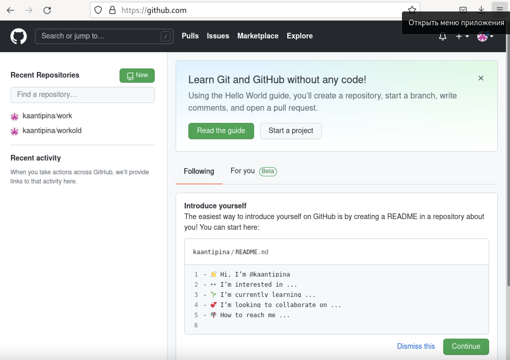{ #fig:001 width=70% }

1.Настраиваем систему контроля версий git.
Синхронизируем учётную запись github с компьютером (рис.-@fig:002):
git config --global user.name "Kristina Antipina"
git config --global user.email "kristina_18_xx@mail.ru" 
Затем создаём новый ключ на github ssh-keygen -C "Kristina Antipina <kristina_18_xx@mail.ru>")(рис. -@fig:003),рис. -@fig:004,рис. -@fig:005) и привязываем его к компьютеру через консоль (рис. -@fig:006,рис. -@fig:007).

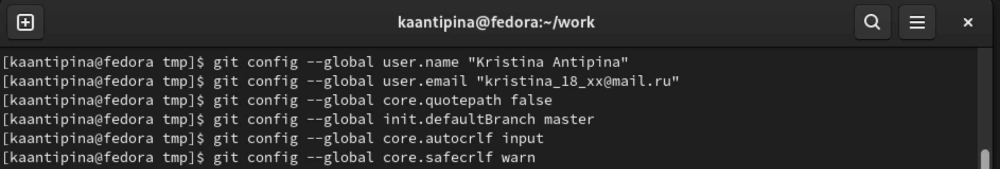{ #fig:002 width=70% }

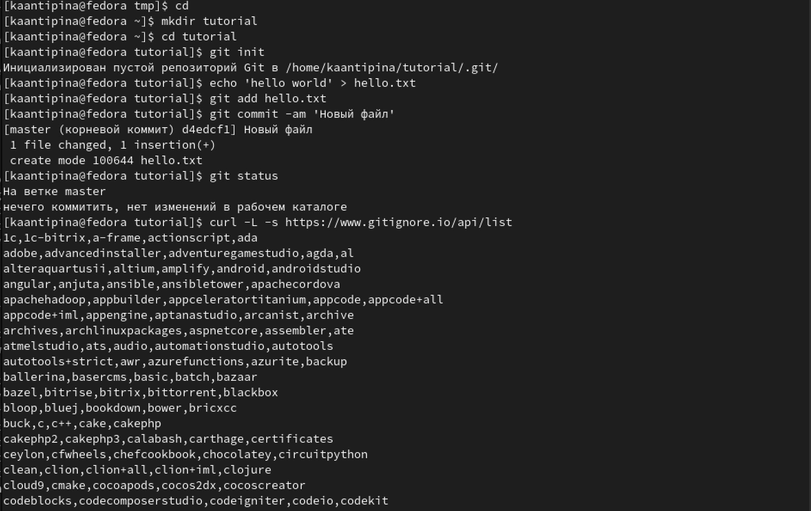{ #fig:003 width=70% }

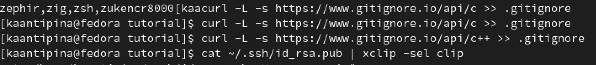{ #fig:004 width=70% }

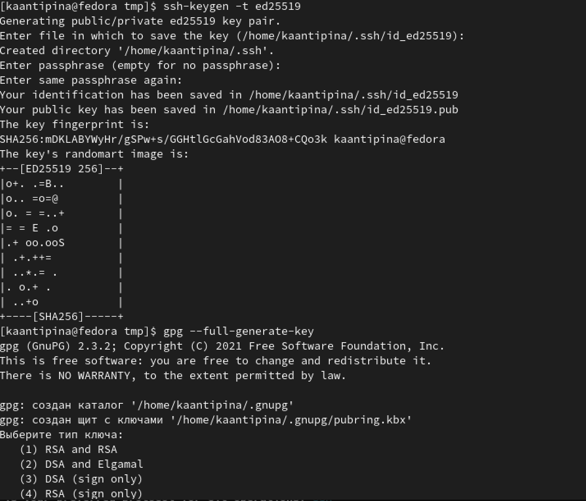{ #fig:005 width=70% }

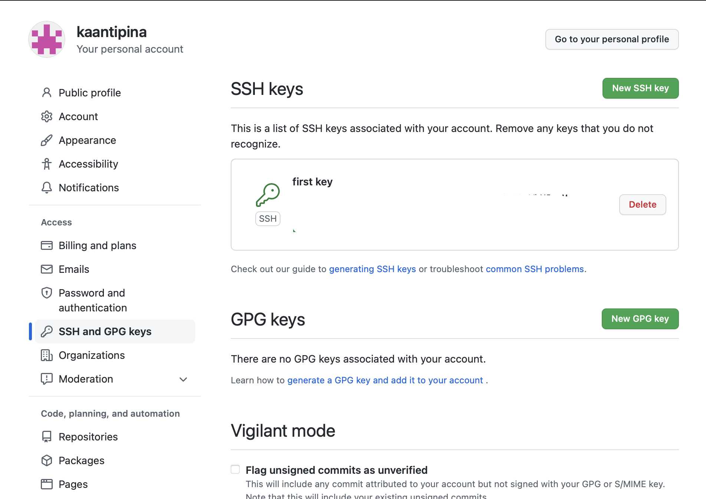{ #fig:006 width=70% }

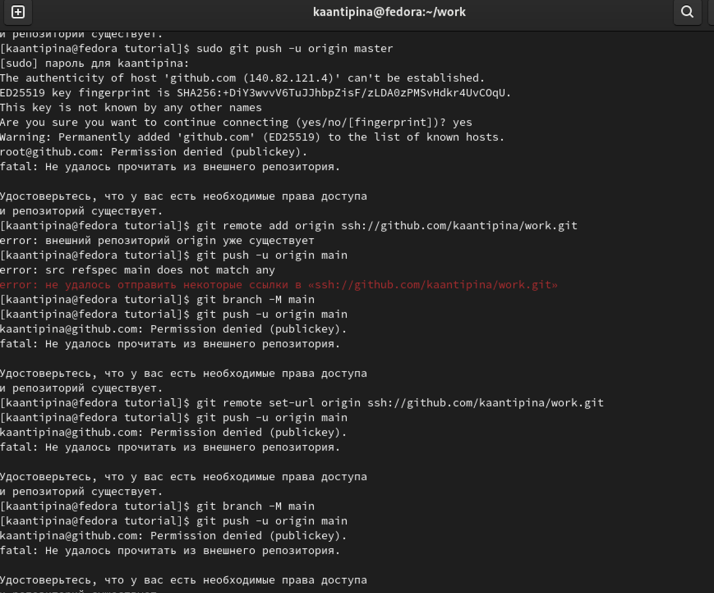{ #fig:007 width=70% }

2.Созданием и подключаем репозиторий к github. 
На сайте заходим в «repository» и создаём новый репозиторий под названием work. Переносим его на наш компьютер (рис. -@fig:008)

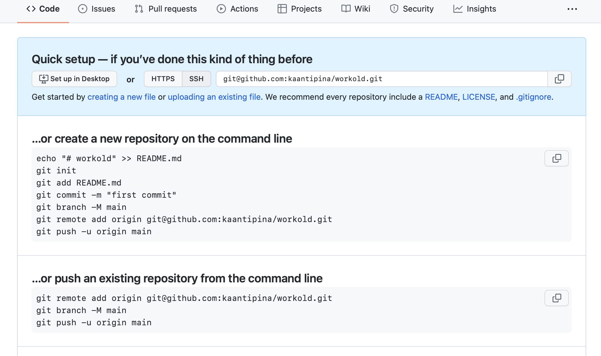{ #fig:008 width=70% }

Создаем рабочий каталог (рис. -@fig:009)

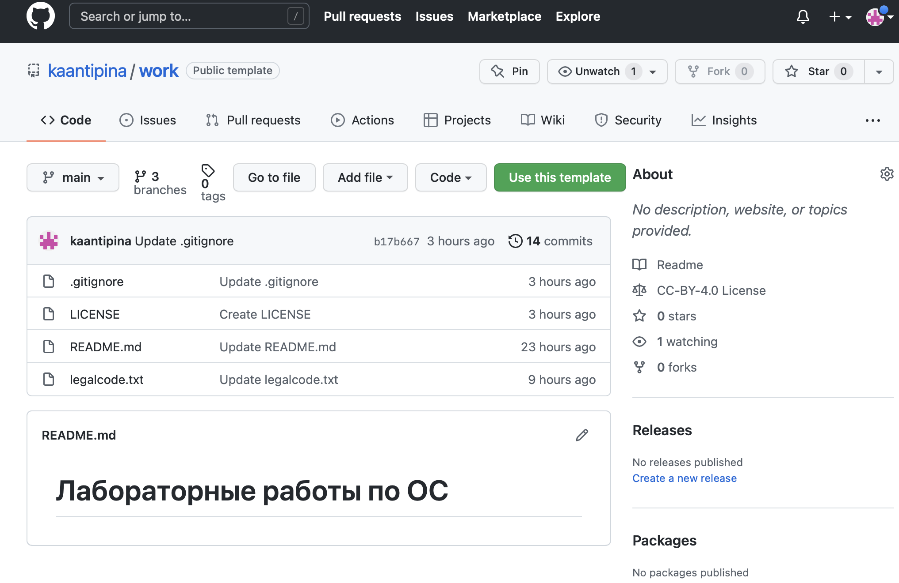{ #fig:009 width=70% }

Добавляем первый commit и выкладываем на github. Для того, чтобы правильно разместить первый коммит, необходимо добавить команду git add ., после этого с помощью команды git commit -m "first commit" выкладываем коммит. Сохраняем первый коммит, используя команду git push (рис. -@fig:010).

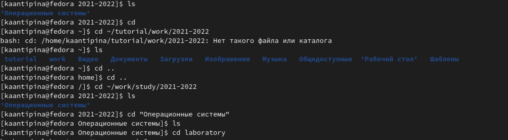{ #fig:010 width=70% }

3.Первичная конфигурация. 
Добавляем файл лицензии. Добавляем шаблон игнорируемых файлов. Просматриваем список имеющихся шаблонов (рис. -@fig:011). Скачиваем шаблон (например, для C) и выполняем коммит. Отправляем на github (команда git push) (рис. -@fig:012).

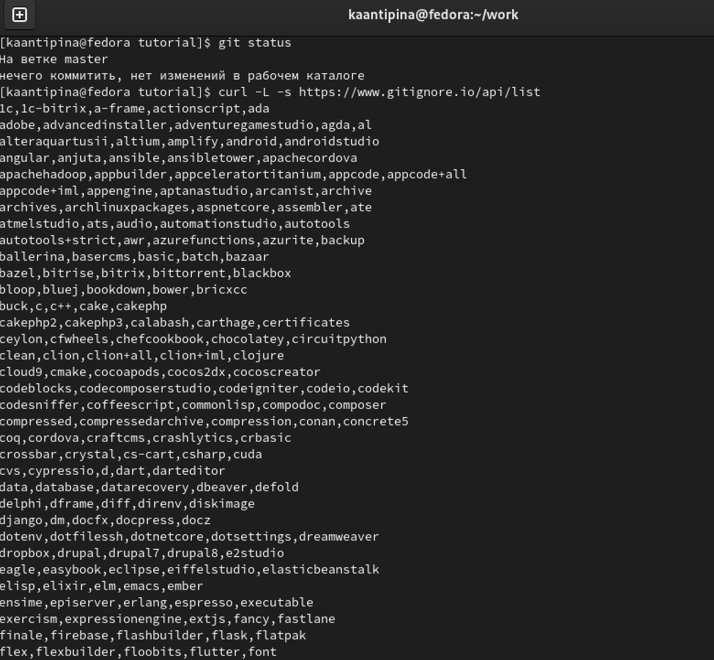{ #fig:011 width=70% }

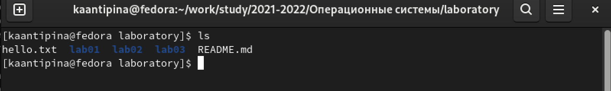{ #fig:012 width=70% }

# Вывод

Я изучила идеологию и применение контроля версий.
