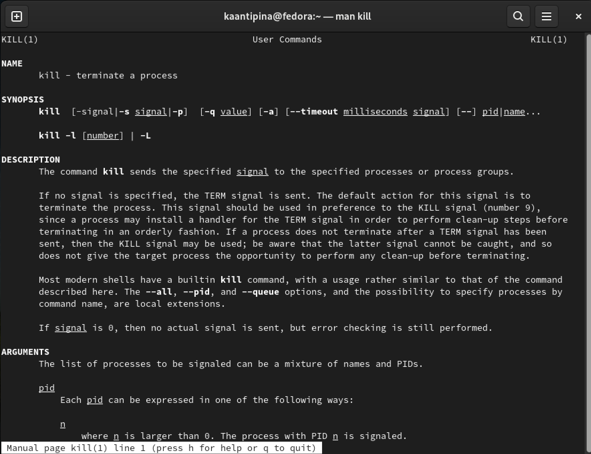

---
## Front matter
lang: ru-RU
title: Отчёт по лабораторной работе №5
author: Кристина Алексеевна Антипина
institute: РУДН, Москва, Россия
date: 5 мая 2022

## Formatting
toc: false
slide_level: 2
theme: metropolis
header-includes: 
 - \metroset{progressbar=frametitle,sectionpage=progressbar,numbering=fraction}
 - '\makeatletter'
 - '\beamer@ignorenonframefalse'
 - '\makeatother'
aspectratio: 43
section-titles: true
---

## Цель работы

Ознакомление с файловой системой Linux, её структурой, именами и содержанием каталогов. Приобретение практических навыков по применению команд для работы с файлами и каталогами, по управлению процессами (и работами), по проверке использования диска и обслуживанию файловой системы.

## Выполнение примеров, описанных в лабораторной работе

Для начала выполним примеры, описанные в первой части описания лабораторной работы (рис. -@fig:001).

{ #fig:001 width=70% }

## Выполним действия из пункта 2 задания

Выполняем следующие действия, описанные в пункте 2 задания (рис. -@fig:002a) (рис. -@fig:002b).

{ #fig:002a width=70% }

{ #fig:002b width=70% }

## Определяем опции команды chmod

Определяем опции команды chmod, необходимые для того, чтобы присвоить соответствующим файлам выделенные права доступа (рис. -@fig:003).

{ #fig:003 width=70% }

## Выполним действия из пункта 4 задания

Выполняем следующие действия, описанные в пункте 4 задания (рис. -@fig:004) (рис. -@fig:005).

{ #fig:004 width=70% }

{ #fig:005 width=70% }

## Используем команду man для других команд

Используя команды «man mount», «man fsck», «man mkfs», «man kill», получим информацию о соответствующих командах.

## Команда mount

Описание команды mount (рис. -@fig:006).

{ #fig:006 width=70% }

## Команда fsck

Описание команды fsck (рис. -@fig:007).

{ #fig:007 width=70% }

## Команда mkfs

Описание команды mkfs (рис. -@fig:008).

{ #fig:008 width=70% }

## Команда kill

Описание команды kill (рис. -@fig:009).

{ #fig:009 width=70% }

## Вывод

В ходе выполнения данной лабораторной работы я ознакомилась с файловой системой Linux, её структурой, именами и содержанием каталогов, получила навыки по применению команд для работы с файлами и каталогами, по управлению процессами, по проверке использования диска и обслуживанию файловой системы.

## {.standout}

Спасибо за внимание!

