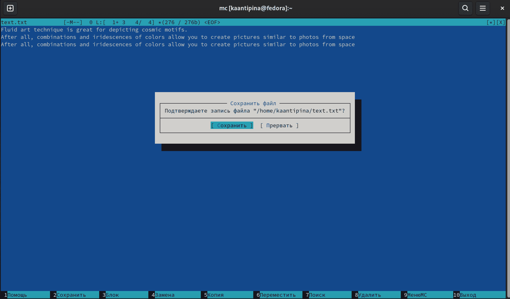

---
## Front matter
lang: ru-RU
title: Командная оболочка Midnight Commander
author: |
      Кристина Алексеевна Антипина НБИбд-01-21\inst{1}
 
institute: |
    \inst{1}Российский Университет Дружбы Народов
 
date: 12 мая, 2022, Москва, Россия
 
## Formatting
mainfont: PT Serif
romanfont: PT Serif
sansfont: PT Sans
monofont: PT Mono
toc: false
slide_level: 2
theme: metropolis
header-includes: 
 - \metroset{progressbar=frametitle,sectionpage=progressbar,numbering=fraction}
 - '\makeatletter'
 - '\beamer@ignorenonframefalse'
 - '\makeatother'
aspectratio: 43
section-titles: true
 
---
 
## Цель работы
 
Освоение основных возможностей командной оболочки Midnight Commander.Приобретение навыков практической работы по просмотру каталогов и файлов; 
манипуляций с ними.
 
## Выполнение лабораторной работы
 
Изучим информацию о mc, вызвав в командной строке man mc. (рис. -@fig:001)
 
{ #fig:001 width=70% }
 
##
 
Запустим из командной строки mc и изучим его структуру и меню.(рис. -@fig:002)
 
{ #fig:002 width=70% }
 
##
 
Выполним несколько операций в mc, используя управляющие клавиши
(операции с панелями; выделение/отмена выделения файлов, копирование/перемещение файлов, получение информации о размере и правах доступа на файлы и/или каталоги и т.п.)(рис. -@fig:003)(рис. -@fig:004)(рис. -@fig:005)
(рис. -@fig:006)
 
{ #fig:003 width=70% }
 
##
 
{ #fig:004 width=70% }
 
##
 
{ #fig:005 width=70% }
 
##
 
{ #fig:006 width=70% }
 
##
 
Выполним основные команды меню левой (или правой) панели. Вывод информации о файлах подробный.(рис. -@fig:007)
 
{ #fig:007 width=70% }
 
##
 
Используя возможности подменим Файл, выполним:
 
– просмотр содержимого текстового файла;(рис. -@fig:008)
 
{ #fig:008 width=70% }
 
##
 
– редактирование содержимого текстового файла (без сохранения результатов
редактирования);
 
– создание каталога;
 
– копирование файлов в созданный каталог.(рис. -@fig:009)(рис. -@fig:010)(рис. -@fig:011)
 
{ #fig:009 width=70% }
 
##
 
{ #fig:010 width=70% }
 
##
 
{ #fig:011 width=70% }
 
##
 
С помощью соответствующих средств подменим Команда осуществим:
– поиск в файловой системе файла с заданными условиями;(рис. -@fig:012)
 
{ #fig:012 width=70% }
 
##
 
– выбор и повторение одной из предыдущих команд;
 
-переход в домашний каталог;
 
– анализ файла меню и файла расширений(рис. -@fig:013)(рис. -@fig:014)(рис. -@fig:015)
 
{ #fig:013 width=70% }
 
##
 
{ #fig:014 width=70% }
 
##
 
{ #fig:015 width=70% }
 
##
 
Вызываем подменю Настройки. Освоим операции, определяющие структуру
экрана mc (Full screen, Double Width, Show Hidden Files и т.д.)(рис. -@fig:016)
 
{ #fig:016 width=70% }
 
##
# Задание по встроенному редактору mc
Создадим текстовой файл text.txt(рис. -@fig:017)
 
{ #fig:017 width=70% }
 
##
 
 Открываем этот файл с помощью встроенного в mc редактора(рис. -@fig:018)
 
{ #fig:018 width=70% }
 
##
 
Вставляем в открытый файл небольшой текст, скопированный из любого источника.(рис. -@fig:019)
 
{ #fig:019 width=70% }
 
##
 
Проделаем с текстом следующие манипуляции, используя горячие клавиши:
 
Удалим строку текста. - F8 (рис. -@fig:020)
 
{ #fig:020 width=70% }
 
##

Выделим фрагмент текста и скопируем его на новую строку. - F5 (рис. -@fig:021)
 
{ #fig:021 width=70% }
 
##

Сохраним файл. - F2 (рис. -@fig:022)
 
{ #fig:022 width=70% }
 
##

Отменим последнее действие. - Ctrl+U (рис. -@fig:023)
 
{ #fig:023 width=70% }
 
##

Перейдем в конец файла - PageDown или Ctrl+X (рис. -@fig:024)
 
{ #fig:024 width=70% }
 
##

Перейдем в начало файла - PageUp или Ctrl+Z (рис. -@fig:025)
 
{ #fig:025 width=70% } 
 
##

Откроем файл с исходным текстом на языке программирования C++ (рис. -@fig:026)
 
{ #fig:026 width=70% }
 
##

Используя меню редактора, выключим подсветку синтаксиса. (рис. -@fig:027)
 
{ #fig:034 width=70% }
 
## Вывод
 
В данной работе я ознакомилась с инструментами командной оболочки Midnight Commander. Приобрела навыки практической работы по просмотру каталогов и файлов.
 
--
