---
## Front matter
lang: ru-RU
title: Текстовой редактор vi
author: |
      Кристина Алексеевна Антипина НБИбд-01-21\inst{1}
 
institute: |
    \inst{1}Российский Университет Дружбы Народов
 
date: 13 мая, 2022, Москва, Россия
 
## Formatting
mainfont: PT Serif
romanfont: PT Serif
sansfont: PT Sans
monofont: PT Mono
toc: false
slide_level: 2
theme: metropolis
header-includes: 
 - \metroset{progressbar=frametitle,sectionpage=progressbar,numbering=fraction}
 - '\makeatletter'
 - '\beamer@ignorenonframefalse'
 - '\makeatother'
aspectratio: 43
section-titles: true
 
---
--

# Цель работы
 
Познакомиться с операционной системой Linux. Получить практические навыки работы с редактором vi,установленным по умолчанию практически во всех дистрибутивах
 
# Выполнение лабораторной работы

# Задание 1. Создание нового файла с использованием vi
 
Создаю каталог с именем ~/work/os/lab06.(рис. -@fig:001)
Перехожу во вновь созданный каталог.(рис. -@fig:002)
Вызываю vi и создаю файл hello.sh
 
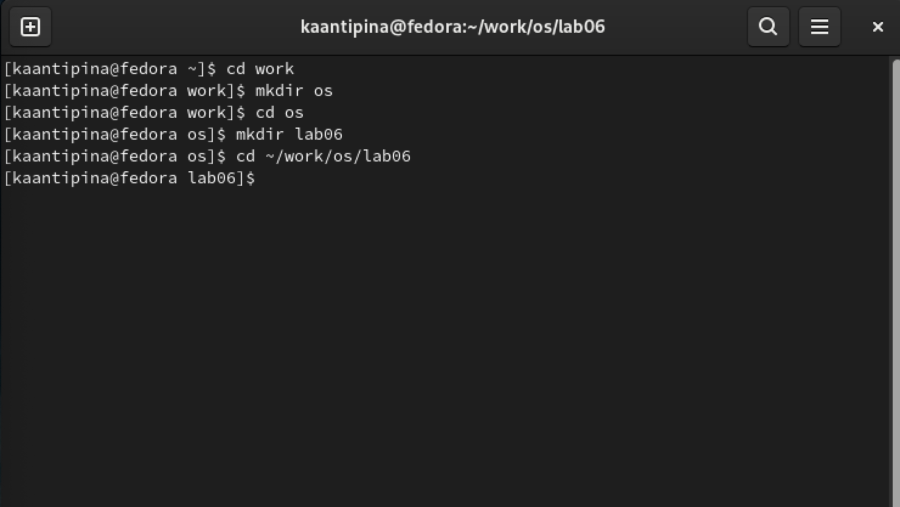{ #fig:001 width=70% }
 
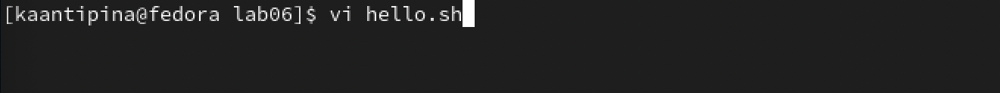{ #fig:002 width=70% }
 
Нажимаю клавишу i и ввожу следующий текст:(рис. -@fig:003)
 
1 #!/bin/bash
2 HELL=Hello
3 function hello {
4 LOCAL HELLO=World
5 echo $HELLO
6 }
7 echo $HELLO
8 hello
 
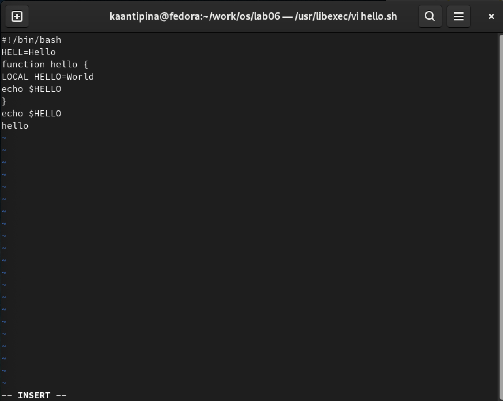{ #fig:003 width=70% }
 
Далее нажимаю клавишу Esc для перехода к командный режим после завершения ввода текста.(рис. -@fig:004)
Также нажимаю ":" для перехода в режим последней строки и внизу экрана появилось приглашение в виде двоеточия.
 
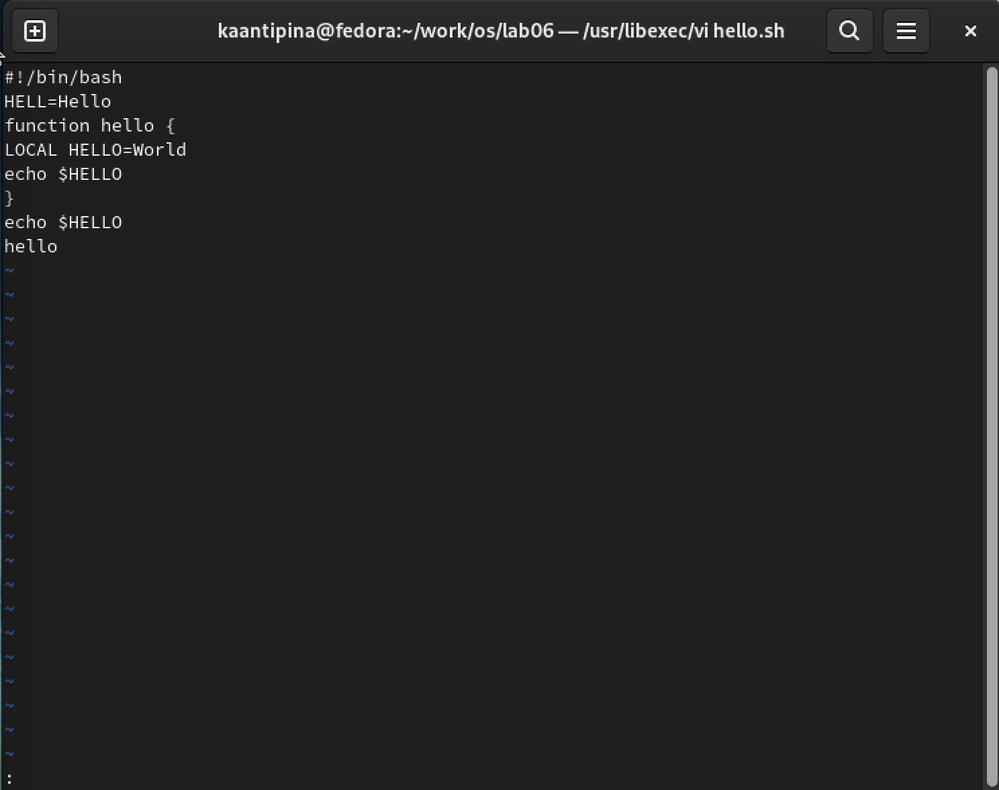{ #fig:004 width=70% }
 
Нажимаю w(записать) и q(выйти), а затем нажимаю клавину Enter для сохранения текста и завершения работы.(рис. -@fig:005)
 
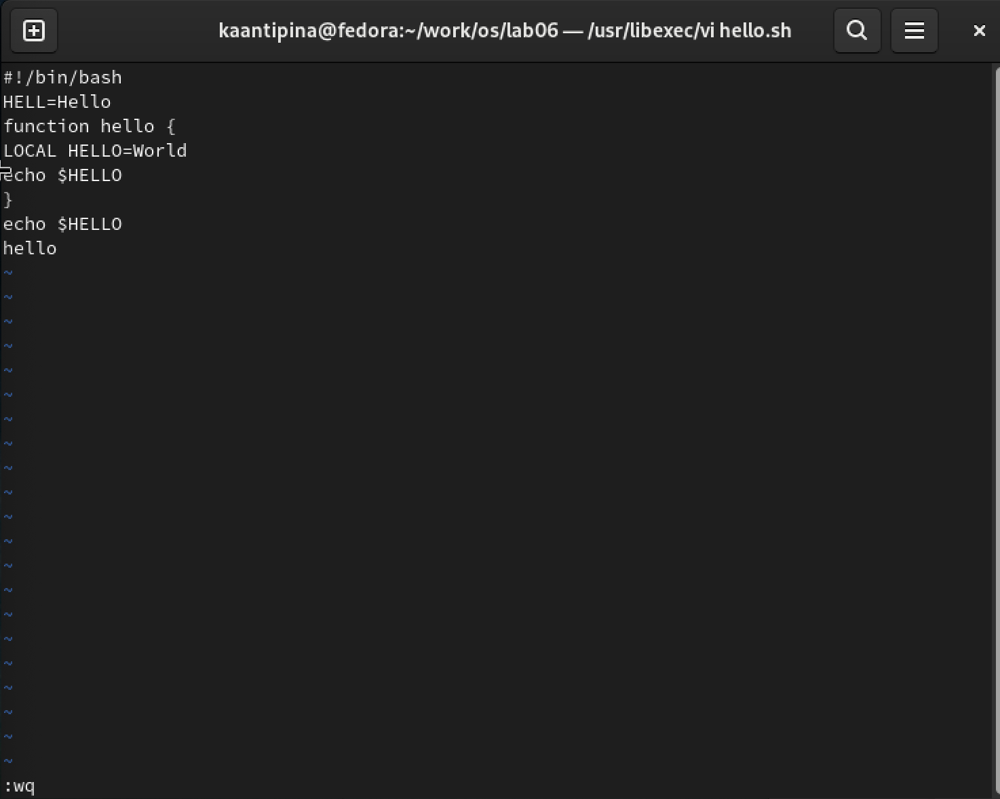{ #fig:005 width=70% }
 
Сделаю файл исполняемым.(рис. -@fig:006)
 
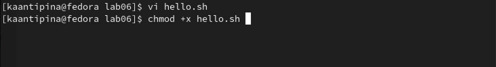{ #fig:006 width=70% }
 
# Задание 2. Редактирование существующего файла
 
Вызываю vi на редактирование файла.(рис. -@fig:007)
 
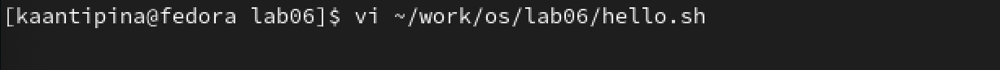{ #fig:007 width=70% }
 
Устанавливаю курсор в конец слова HELL второй строки.(рис. -@fig:008)
 
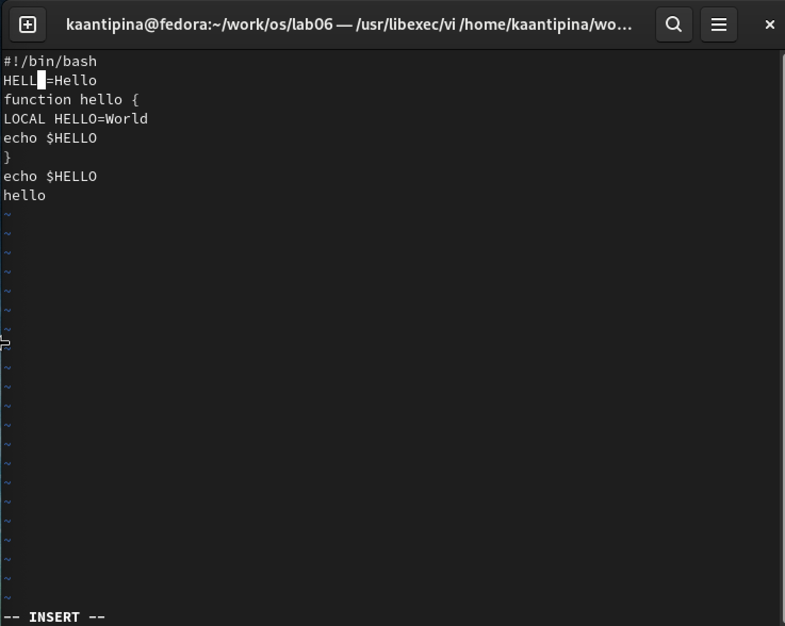{ #fig:008 width=70% }
 
Далее перехожу в режим вставки и заменяю его на HELLO,  нажимаю Esc для возврата в командый режим.(рис. -@fig:009)
 
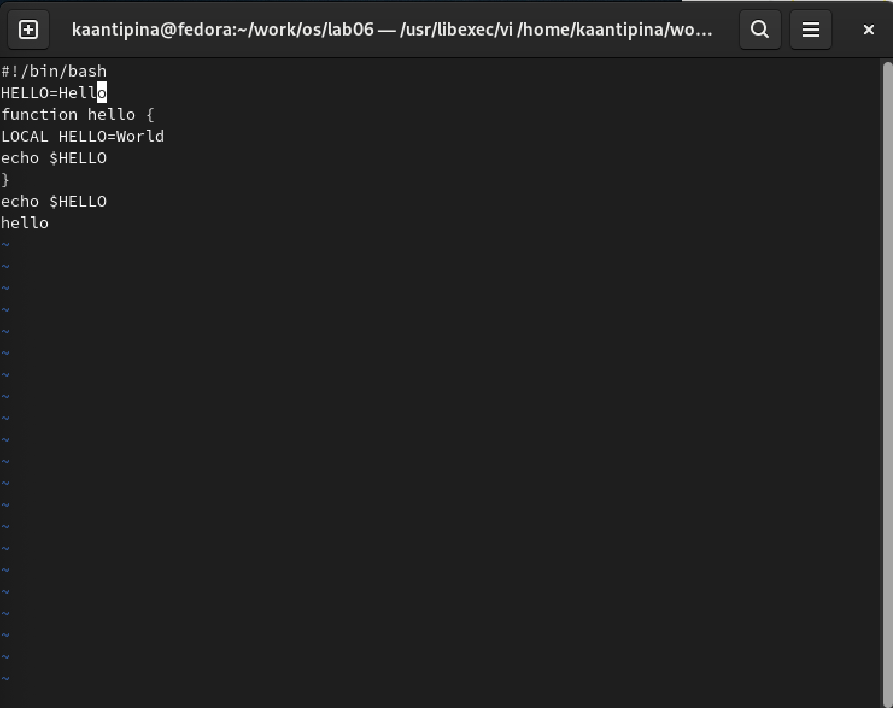{ #fig:009 width=70% }
 
Устанавливаю курсор на четвертую строку и сотру слово LOCAL.(рис. -@fig:010)
 
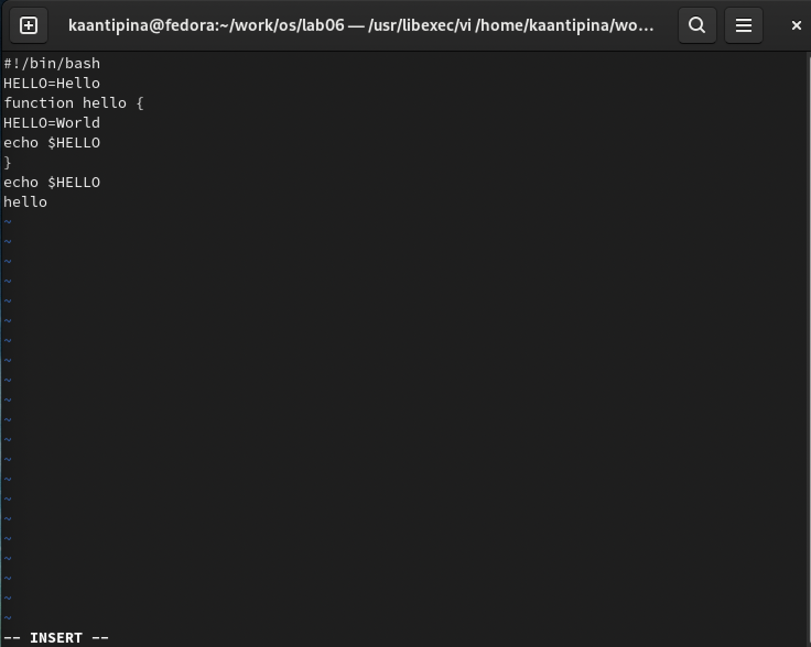{ #fig:010 width=70% }
 
Перехожу в режим вставки и набираю следующий текст: local, нажимаю Esc для возврата в командный режим.(рис. -@fig:011)
 
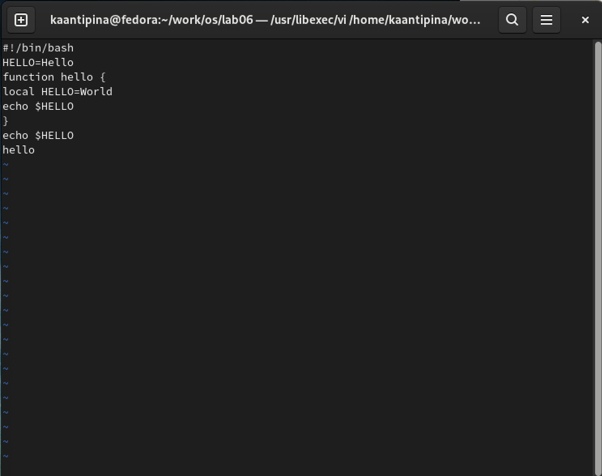{ #fig:011 width=70% }
 
Устанавливаю курсор на последней строке файла. Вставляю после неё строку, содержащую следующий текст: echo $HELLO.(рис. -@fig:012)
 
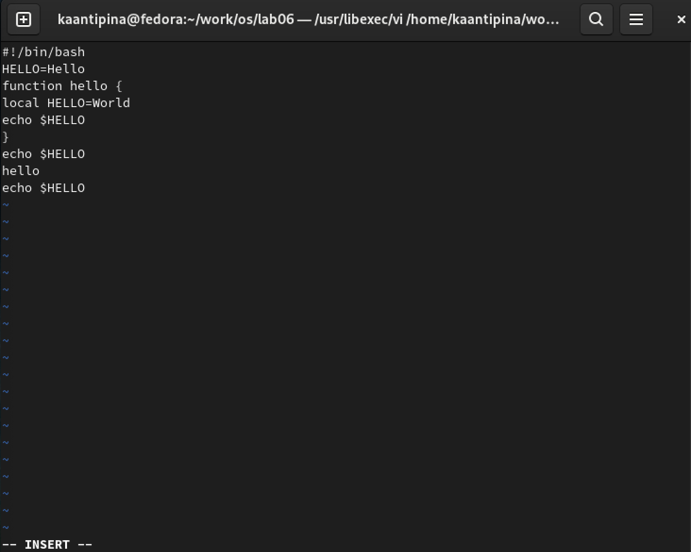{ #fig:012 width=70% }
 
Нажимаю Esc для перехода в командный режим.
Удаляю последнюю строку.(рис. -@fig:013)
 
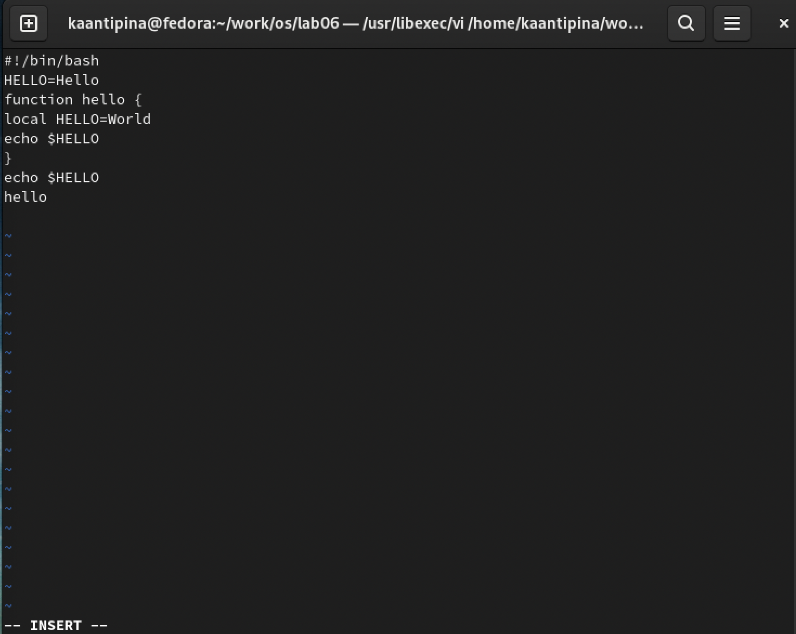{ #fig:013 width=70% }
 
Ввожу команду отмены изменений u для отмены последней команды(рис. -@fig:014)
 
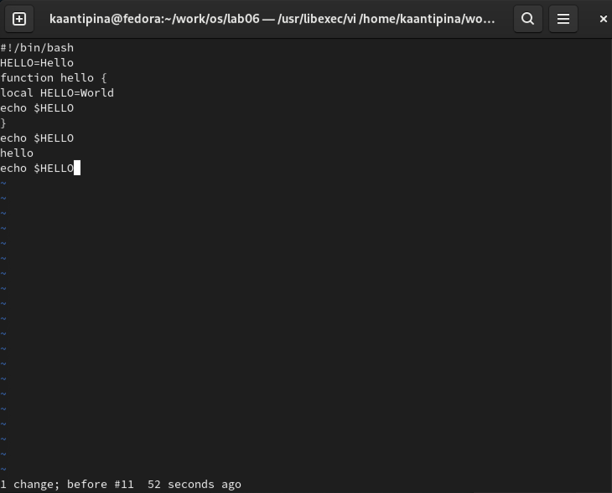{ #fig:014 width=70% }
 
Ввожу символ «:» для перехода в режим последней строки. Записываю произведённые изменения и выхожу из vi.(рис. -@fig:015)
 
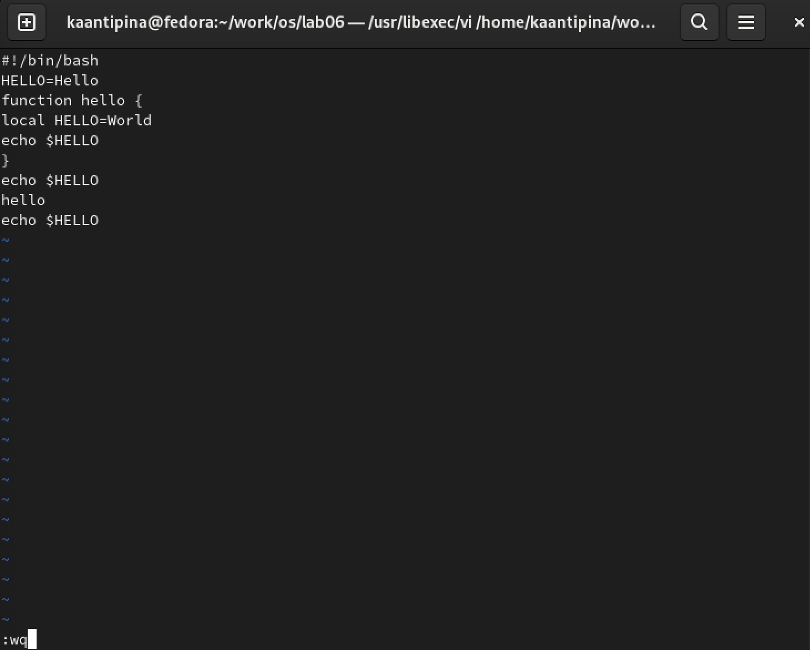{ #fig:015 width=70% }
 
# Вывод
 
Я ознакомилась с операционной системой Linux, получила практические навыки работы с редактором vi, установленным по умолчанию практически во всех дистрибутивах.
