---
# Front matter
lang: ru-RU
title: "Отчёт по лабораторной работе № 8"
subtitle: "Редактор Vi"
author: "Кристина Алексеевна Антипина НБИбд-01-21"
 
# Formatting
toc-title: "Содержание"
toc: true # Table of contents
toc_depth: 2
lof: true # List of figures
fontsize: 12pt
linestretch: 1.5
papersize: a4paper
documentclass: scrreprt
polyglossia-lang: russian
polyglossia-otherlangs: english
mainfont: PT Serif
romanfont: PT Serif
sansfont: PT Sans
monofont: PT Mono
mainfontoptions: Ligatures=TeX
romanfontoptions: Ligatures=TeX
sansfontoptions: Ligatures=TeX,Scale=MatchLowercase
monofontoptions: Scale=MatchLowercase
indent: true
pdf-engine: lualatex
header-includes:
  - \linepenalty=10 # the penalty added to the badness of each line within a paragraph (no associated penalty node) Increasing the value makes tex try to have fewer lines in the paragraph.
  - \interlinepenalty=0 # value of the penalty (node) added after each line of a paragraph.
  - \hyphenpenalty=50 # the penalty for line breaking at an automatically inserted hyphen
  - \exhyphenpenalty=50 # the penalty for line breaking at an explicit hyphen
  - \binoppenalty=700 # the penalty for breaking a line at a binary operator
  - \relpenalty=500 # the penalty for breaking a line at a relation
  - \clubpenalty=150 # extra penalty for breaking after first line of a paragraph
  - \widowpenalty=150 # extra penalty for breaking before last line of a paragraph
  - \displaywidowpenalty=50 # extra penalty for breaking before last line before a display math
  - \brokenpenalty=100 # extra penalty for page breaking after a hyphenated line
  - \predisplaypenalty=10000 # penalty for breaking before a display
  - \postdisplaypenalty=0 # penalty for breaking after a display
  - \floatingpenalty = 20000 # penalty for splitting an insertion (can only be split footnote in standard LaTeX)
  - \raggedbottom # or \flushbottom
  - \usepackage{float} # keep figures where there are in the text
  - \floatplacement{figure}{H} # keep figures where there are in the text
---
--
 
# Цель работы
 
Познакомиться с операционной системой Linux. Получить практические навыки работы с редактором vi,установленным по умолчанию практически во всех дистрибутивах
 
# Задание 1. Создание нового файла с использованием vi
 
1. Создайте каталог с именем ~/work/os/lab06.
2. Перейдите во вновь созданный каталог.
3. Вызовите vi и создайте файл hello.sh
4. Нажмите клавишу i и вводите следующийтекст.
5. Нажмите клавишу Esc для перехода в командный режим после завершения ввода
текста.
6. Нажмите : для перехода в режим последней строки и внизу вашего экрана появится
приглашение в виде двоеточия.
7. Нажмите w (записать)и q (выйти),а затем на жмите клавишу Enter для сохранения
вашего текста и завершения работы.
8. Сделайте файл исполняемым
 
# Задание 2  Редактирование существующего файла
 
1. Вызовите vi на редактирование файла
2. Установите курсор в конец слова HELL второй строки.
3. Перейдите в режим вставки и замените на HELLO.Нажмите Esc длявозвратавкомандный режим.
4. Установите курсор на четвертую строку и сотрите слово LOCAL.
5. Перейдите в режим вставки и наберите следующий текст: local, нажмите Esc для
возврата в командный режим.
6. Установите курсор на последней строке файла.Вставьте после неё строку,содержащую следующийтекст: echo $HELLO.
7. Нажмите Esc для перехода в командный режим.
8. Удалите последнюю строку.
9. Введите команду отмены изменений u для отмены последней команды.
10. Введитесимвол : для перехода в режим последней строки.Запишите произведённые изменения и выйдите из vi.
 
# Выполнение лабораторной работы
# Задание 1. Создание нового файла с использованием vi
 
Создаю каталог с именем ~/work/os/lab06.(рис. -@fig:001)
Перехожу во вновь созданный каталог.(рис. -@fig:002)
Вызываю vi и создаю файл hello.sh
 
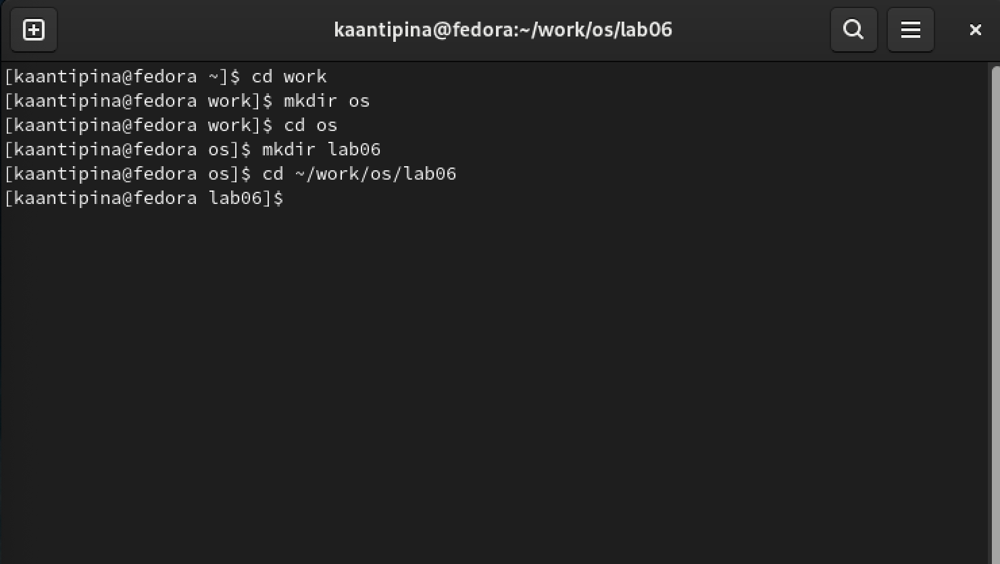{ #fig:001 width=70% }
 
{ #fig:002 width=70% }
 
Нажимаю клавишу i и ввожу следующий текст:(рис. -@fig:003)
 
1 #!/bin/bash
2 HELL=Hello
3 function hello {
4 LOCAL HELLO=World
5 echo $HELLO
6 }
7 echo $HELLO
8 hello
 
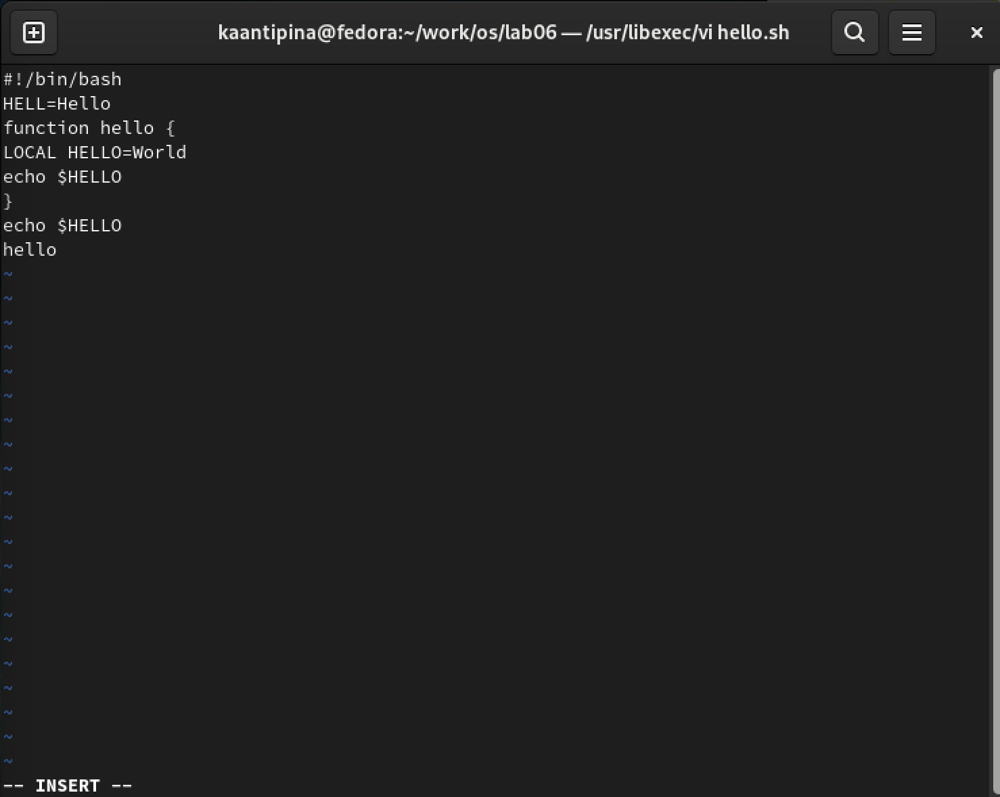{ #fig:003 width=70% }
 
Далее нажимаю клавишу Esc для перехода к командный режим после завершения ввода текста.(рис. -@fig:004)
Также нажимаю ":" для перехода в режим последней строки и внизу экрана появилось приглашение в виде двоеточия.
 
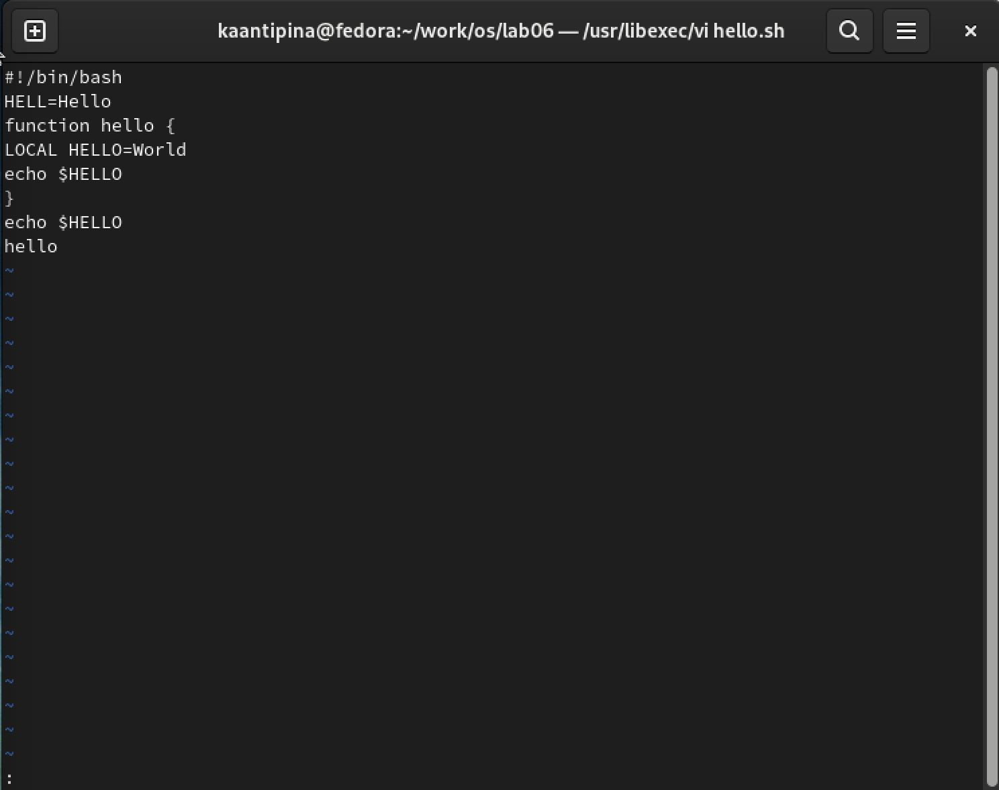{ #fig:004 width=70% }
 
Нажимаю w(записать) и q(выйти), а затем нажимаю клавину Enter для сохранения текста и завершения работы.(рис. -@fig:005)
 
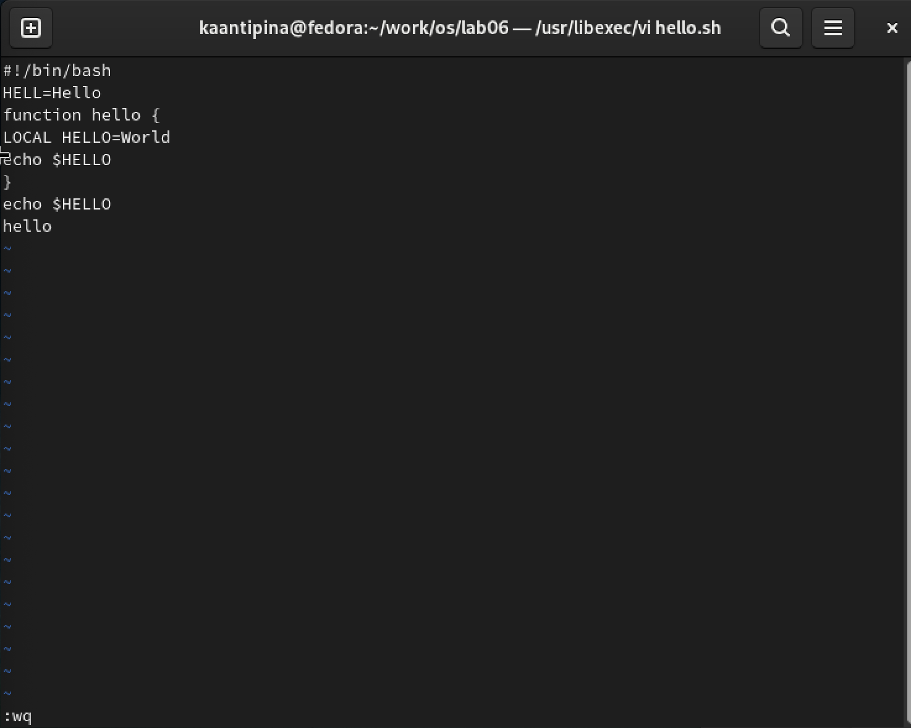{ #fig:005 width=70% }
 
Сделаю файл исполняемым.(рис. -@fig:006)
 
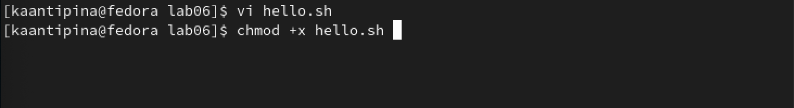{ #fig:006 width=70% }
 
# Задание 2. Редактирование существующего файла
 
Вызываю vi на редактирование файла.(рис. -@fig:007)
 
{ #fig:007 width=70% }
 
Устанавливаю курсор в конец слова HELL второй строки.(рис. -@fig:008)
 
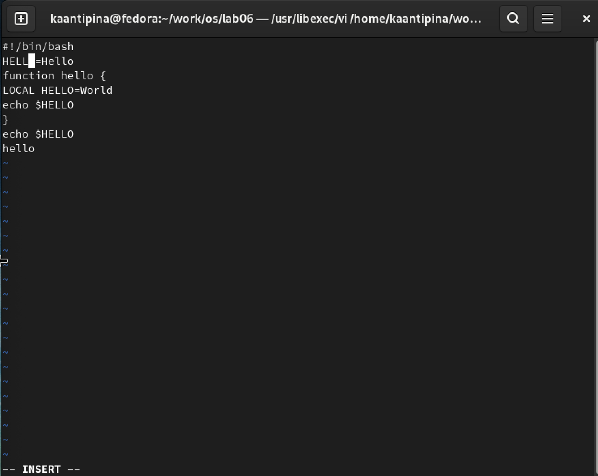{ #fig:008 width=70% }
 
Далее перехожу в режим вставки и заменяю его на HELLO,  нажимаю Esc для возврата в командый режим.(рис. -@fig:009)
 
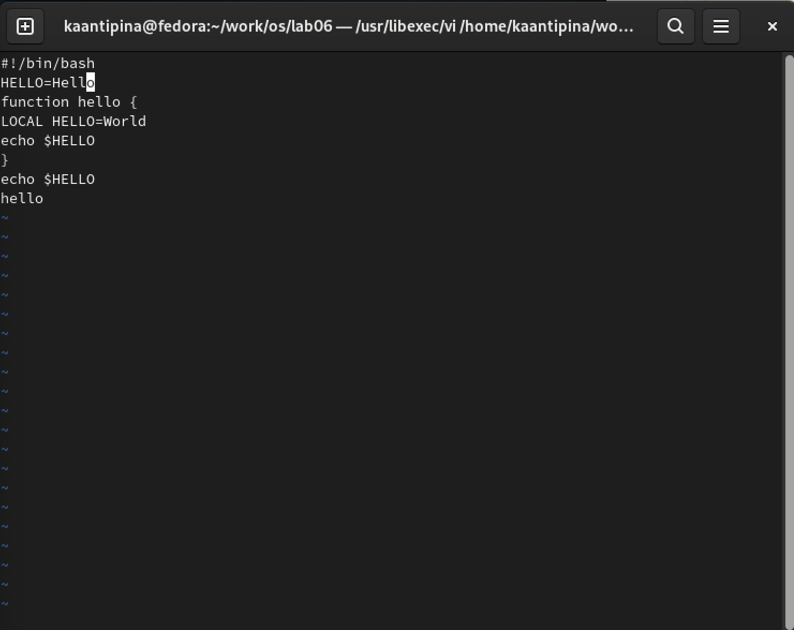{ #fig:009 width=70% }
 
Устанавливаю курсор на четвертую строку и сотру слово LOCAL.(рис. -@fig:010)
 
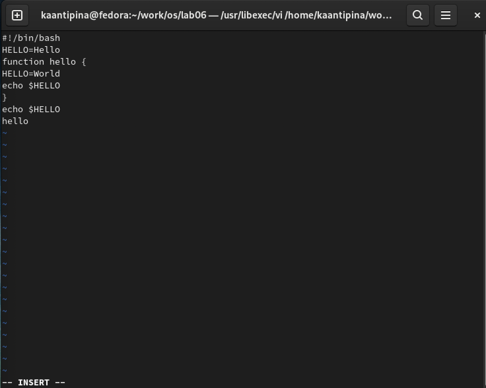{ #fig:010 width=70% }
 
Перехожу в режим вставки и набираю следующий текст: local, нажимаю Esc для возврата в командный режим.(рис. -@fig:011)
 
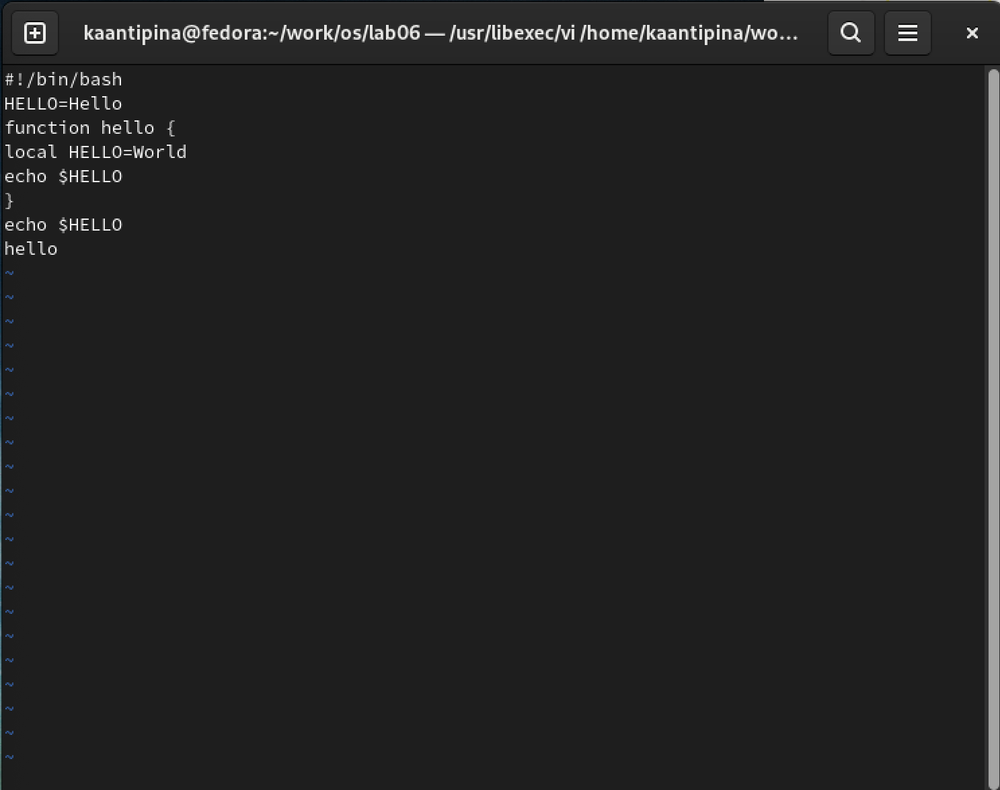{ #fig:011 width=70% }
 
Устанавливаю курсор на последней строке файла. Вставляю после неё строку, содержащую следующий текст: echo $HELLO.(рис. -@fig:012)
 
{ #fig:012 width=70% }
 
Нажимаю Esc для перехода в командный режим.
Удаляю последнюю строку.(рис. -@fig:013)
 
{ #fig:013 width=70% }
 
Ввожу команду отмены изменений u для отмены последней команды(рис. -@fig:014)
 
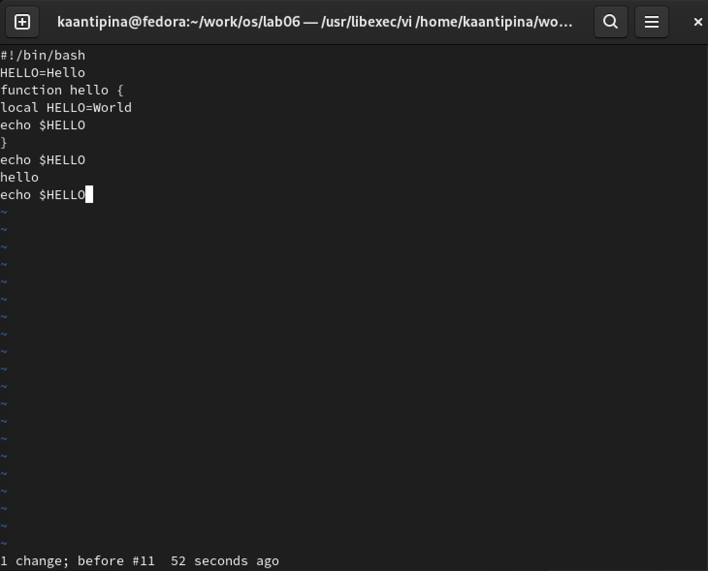{ #fig:014 width=70% }
 
Ввожу символ «:» для перехода в режим последней строки. Записываю произведённые изменения и выхожу из vi.(рис. -@fig:015)
 
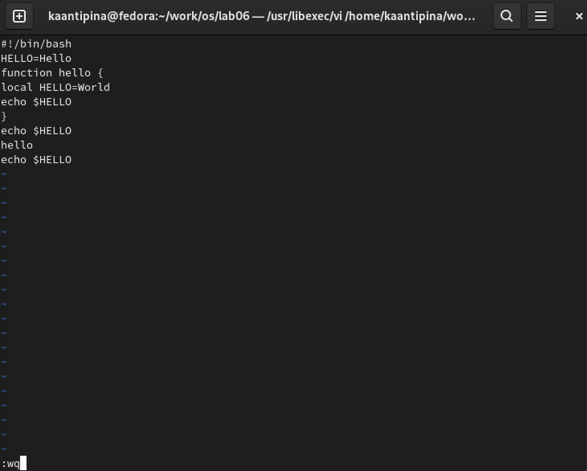{ #fig:015 width=70% }
 
# Вывод
 
Я ознакомилась с операционной системой Linux, получила практические навыки работы с редактором vi, установленным по умолчанию практически во всех дистрибутивах.
 
# Контрольные вопросы
 
1. Дайте краткую характеристику режимам работы редактора vi.
 
2. Как выйти из редактора,не сохраняя произведённые изменения?
 
3. Назовите и дайте краткую характеристику командам позиционирования.
 
4. Что для редактора vi является словом?
 
5. Каким образом из любого места редактируемого файла перейти в начало (конец)
файла?
 
6. Назовите и дайте краткую характеристику основным группам команд редактирования.
 
7. Необходимо заполнить строку символами $.Каковы ваши действия?
 
8. Как отменить некорректное действие,связанное с процессом редактирования?
 
9. Назовите и дайте характеристику основным группам команд режима последней строки.
 
10. Как определить,не перемещая курсора,позицию,в которой заканчивается строка?
 
11. Выполните анализ опций редактора vi (сколько их,как узнать их назначение ит.д.).
 
12. Как определить режим работы редактора vi?
 
13. Постройте граф взаимосвязи режимов работы редактора vi.
 
# Ответы на контрольные вопросы:
 
1. Краткая характеристика режимов работы редактора vi:
– командный режим — предназначен для ввода команд редактирования и навигации по редактируемому файлу;
– режим вставки — предназначен для ввода содержания редактируемого файла;
– режим последней (или командной) строки — используется для записи изменений
в файл и выхода из редактора.
 
2. Выйти из редактора, не сохраняя произведённые изменения, можно используя клавиши «:q!» в командном режиме.
3. Краткую характеристика команд позиционирования:
– 0 (ноль) — переход в начало строки;
– $ — переход в конец строки;
– G — переход в конец файла;
– n G — переход на строку с номером n.
 
4. Для редактора vi словом является: пробел; буквы, находящиеся между двумя пробелами.
 
5. Из любого места редактируемого файла перейти в конец файла можно с помощью клавишы G и курсора вниз, а в начало – курсор вверх.
 
6. Краткая характеристика основных групп команд редактирования:
Вставка текста
– а — вставить текст после курсора;
– А — вставить текст в конец строки;
– i — вставить текст перед курсором;
– n i — вставить текст n раз;
– I — вставить текст в начало строки.
Вставка строки
– о — вставить строку под курсором;
– О — вставить строку над курсором.
 Удаление текста
– x — удалить один символ в буфер;
– d w — удалить одно слово в буфер;
– d $ — удалить в буфер текст от курсора до конца строки;
– d 0 — удалить в буфер текст от начала строки до позиции курсора;
– d d — удалить в буфер одну строку;
– n d d — удалить в буфер n строк.
 Отмена и повтор произведённых изменений
– u — отменить последнее изменение;
– . — повторить последнее изменение.
Копирование текста в буфер
– Y — скопировать строку в буфер;
– n Y — скопировать n строк в буфер;
– y w — скопировать слово в буфер.
Вставка текста из буфера
– p — вставить текст из буфера после курсора;
– P — вставить текст из буфера перед курсором.
 Замена текста
– c w — заменить слово;
– n c w — заменить n слов;
– c $ — заменить текст от курсора до конца строки;
– r — заменить слово;
– R — заменить текст.
Поиск текста
– / текст — произвести поиск вперёд по тексту указанной строки символов текст;
– ? текст — произвести поиск назад по тексту указанной строки символов текст.
 
7. Чтобы заполнить строку символами $ можно использовать клавиши ni(вставить текст n раз).
 
8. Отменить некорректное действие, связанное с процессом редактирования, можно с помощью клавиши «.».
 
9. Характеристика основных групп команд режима последней строки:
Копирование и перемещение текста
– : n,m d — удалить строки с n по m;
– : i,j m k — переместить строки с i по j, начиная со строки k;
– : i,j t k — копировать строки с i по j в строку k;
– : i,j w имя-файла — записать строки с i по j в файл с именем имя-файла.
Запись в файл и выход из редактора
– : w — записать изменённый текст в файл, не выходя из vi;
– : w имя-файла — записать изменённый текст в новый файл с именем имяфайла;
– : w ! имя-файла — записать изменённый текст в файл с именем имяфайла;
– : w q — записать изменения в файл и выйти из vi;
– : q — выйти из редактора vi;
– : q ! — выйти из редактора без записи;
– : e ! — вернуться в командный режим, отменив все изменения, произведённые со времени последней записи.
 
10. Определить, не перемещая курсора, позицию, в которой заканчивается строка, можно используя клавишу $ (переход в конец строки).
 
11. Опции редактора vi позволяют настроить рабочую среду. Для задания опций
используется команда set (в режиме последней строки):
– : set all — вывести полный список опций;
– : set nu — вывести номера строк;
– : set list — вывести невидимые символы;
– : set ic — не учитывать при поиске, является ли символ прописным или
строчным.
Если вы хотите отказаться от использования опции, то в команде set перед именем опции надо поставить no.
 
12. Определить режим работы редактора vi можно по последней командной строке.
 
13. Взаимосвязь режимов работы редактора vi:
«Командный режим»     -     «Режим вставки»
                          \                             /
                 «Режим командной строки»
--
