---
# Front matter
lang: ru-RU
title: "Отчёт по лабораторной работе № 9"
subtitle: "Текстовой редактор emacs"
author: "Кристина Алексеевна Антипина НБИбд-01-21"
 
# Formatting
toc-title: "Содержание"
toc: true # Table of contents
toc_depth: 2
lof: true # List of figures
fontsize: 12pt
linestretch: 1.5
papersize: a4paper
documentclass: scrreprt
polyglossia-lang: russian
polyglossia-otherlangs: english
mainfont: PT Serif
romanfont: PT Serif
sansfont: PT Sans
monofont: PT Mono
mainfontoptions: Ligatures=TeX
romanfontoptions: Ligatures=TeX
sansfontoptions: Ligatures=TeX,Scale=MatchLowercase
monofontoptions: Scale=MatchLowercase
indent: true
pdf-engine: lualatex
header-includes:
  - \linepenalty=10 # the penalty added to the badness of each line within a paragraph (no associated penalty node) Increasing the value makes tex try to have fewer lines in the paragraph.
  - \interlinepenalty=0 # value of the penalty (node) added after each line of a paragraph.
  - \hyphenpenalty=50 # the penalty for line breaking at an automatically inserted hyphen
  - \exhyphenpenalty=50 # the penalty for line breaking at an explicit hyphen
  - \binoppenalty=700 # the penalty for breaking a line at a binary operator
  - \relpenalty=500 # the penalty for breaking a line at a relation
  - \clubpenalty=150 # extra penalty for breaking after first line of a paragraph
  - \widowpenalty=150 # extra penalty for breaking before last line of a paragraph
  - \displaywidowpenalty=50 # extra penalty for breaking before last line before a display math
  - \brokenpenalty=100 # extra penalty for page breaking after a hyphenated line
  - \predisplaypenalty=10000 # penalty for breaking before a display
  - \postdisplaypenalty=0 # penalty for breaking after a display
  - \floatingpenalty = 20000 # penalty for splitting an insertion (can only be split footnote in standard LaTeX)
  - \raggedbottom # or \flushbottom
  - \usepackage{float} # keep figures where there are in the text
  - \floatplacement{figure}{H} # keep figures where there are in the text
---
--
 
# Цель работы
 
Познакомиться с операционной системой Linux.Получить практические навыки работы с редактором emacs
 
# Задание 1 Создание нового файла с использованием emacs
 
1. Открыть emacs.
 
2. Создать файл lab07.sh с помощью комбинации Ctrl-x Ctrl-f (C-x C-f).
 
3. Наберите текст:
 
1 #!/bin/bash
 
2 HELL=Hello
 
3 function hello {
 
4 LOCAL HELLO=World
 
5 echo $HELLO
 
6 }
 
7 echo $HELLO
 
8 hello
 
4. Сохранить файл с помощью комбинации Ctrl-x Ctrl-s (C-x C-s).
 
5. Проделать с текстом стандартные процедуры редактирования,каждое действие долж-
но осуществляться комбинацией клавиш.
 
5.1. Вырезать одной командой целую строку (С-k).
 
5.2. Вставить эту строку в конец файла (C-y).
 
5.3. Выделить областьтекста (C-space).
 
5.4. Скопировать область в буфер обмена (M-w).
 
5.5. Вставить область в конец файла.
 
5.6. Вновь выделить эту область и на этотраз вырезать её (C-w).
 
5.7. Отмените последнее действие (C-/).
 
6. Научитесь использовать команды по перемещению курсора.
 
6.1. Переместите курсор в начало строки (C-a).
 
6.2. Переместите курсор в конец строки (C-e).
 
6.3. Переместите курсор в начало буфера (M-<).
 
6.4. Переместите курсор в конец буфера (M->).
 
7. Управление буферами.
 
7.1. Вывести список активных буферов на экран (C-x C-b)
 
7.2. Переместитесь во вновь открытое окно (C-x) o со списком открытых буферов
и переключитесь на другой буфер.
 
7.3. Закройте это окно (C-x 0).
 
7.4. Теперь вновь переключайтесь между буферами,но уже без вывода их списка на
экран (C-x b).
 
8. Управление окнами.
 
8.1. Поделите фрейм на 4 части: разделите фрейм на два окна по вертикали (C-x 3),
а затем каждое из этих окон на две части по горизонтали (C-x 2) 
 
8.2. В каждом из четырёх созданных окон откройте новый буфер (файл) и введите
несколько строктекста.
 
9. Режим поиска
 
9.1. Переключитесьв режим поиска (C-s) и найдите несколько слов,присутствующих
втексте.
 
9.2. Переключайтесь между результатами поиска,нажимая C-s.
 
9.3. Выйдите из режима поиска,нажав C-g.
 
9.4. Перейдите в режим поиска и замены (M-%),введитетекст,который следует найти
и заменить,нажмите Enter ,затем введитетекстдля замены.Послетого как будут
подсвечены результаты поиска,нажмите ! для подтверждения замены.
 
9.5. Испробуйте другой режим поиска,нажав M-s o.Объясните,чем он отличается от
обычного режима?
 
 
# Выполнение лабораторной работы
 
# Создание нового файла с использованием vi
 
1.Открываю emacs.(рис. -@fig:001)
 
{ #fig:001 width=70% }
 
2.Создаю файл lab07.sh с помощью комбинации Ctrl-x Ctrl-f (C-x C-f).(рис. -@fig:002)
 
{ #fig:002 width=70% }
 
3.Набираю текст:(рис. -@fig:003)
 
1 #!/bin/bash
 
2 HELL=Hello
 
3 function hello {
 
4 LOCAL HELLO=World
 
5 echo $HELLO
 
6 }
 
7 echo $HELLO
 
8 hello
 
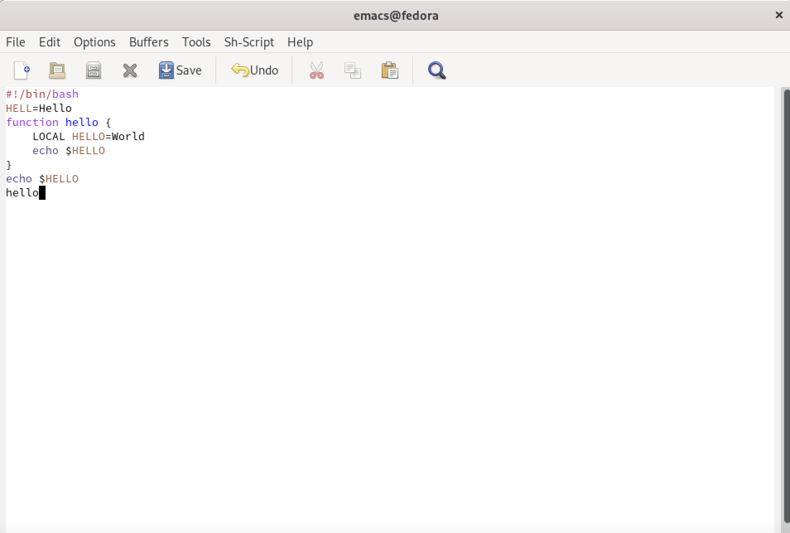{ #fig:003 width=70% }
 
4. Сохраняю файл с помощью комбинации Ctrl-x Ctrl-s (C-x C-s).(рис. -@fig:004)
 
5. Проделаю с текстом стандартные процедуры редактирования, каждое действие осуществлялось комбинацией клавиш.
 
5.1. Вырезаю одной командой целую строку (С-k).
 
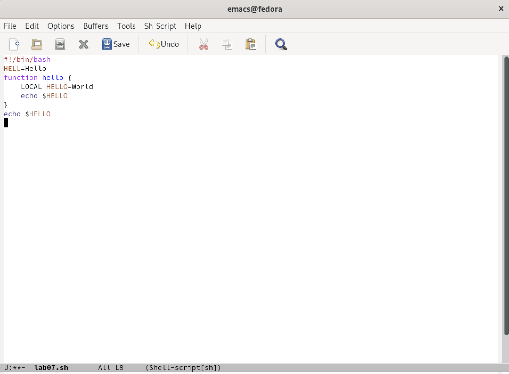{ #fig:004 width=70% }
 
5.2. Вставляю эту строку в конец файла (C-y).(рис. -@fig:005)
 
{ #fig:005 width=70% }
 
5.3. Выделяю область текста (C-space).(рис. -@fig:006)
 
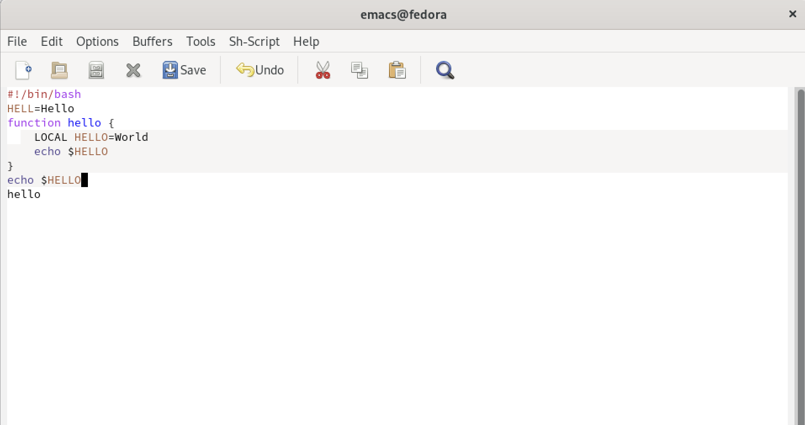{ #fig:006 width=70% }
 
5.4. Скопирую область в буфер обмена (M-w).(рис. -@fig:007)
 
5.5. Вставлю область в конец файла.
 
{ #fig:007 width=70% }
 
5.6. Вновь выделю эту область и на этот раз вырежу её (C-w).(рис. -@fig:008)
 
{ #fig:008 width=70% }
 
5.7. Отменю последнее действие (C-/).(рис. -@fig:009)
 
{ #fig:009 width=70% }
 
6. Научусь использовать команды по перемещению курсора.
 
6.1. Перемещаю курсор в начало строки (C-a).(рис. -@fig:010)
 
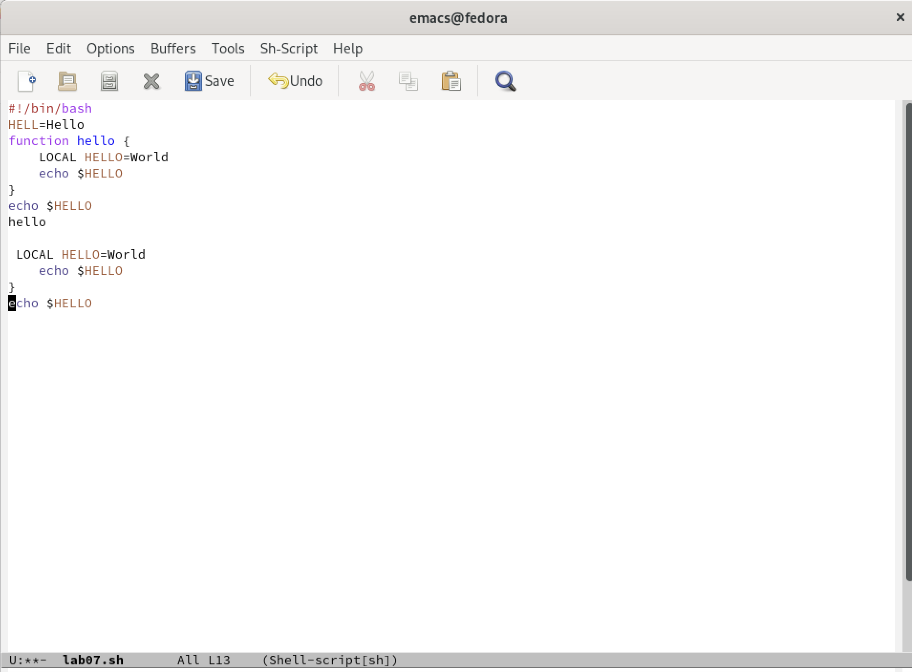{ #fig:010 width=70% }
 
6.2. Перемещаю курсор в конец строки (C-e).(рис. -@fig:011)
 
{ #fig:011 width=70% }
 
Перемещаю курсор в начало буфера (M-<), а также в конец буфера (M->).
 
7. Управление буферами.
 
7.1. Вывожу список активных буферов на экран (C-x C-b).(рис. -@fig:012)
 
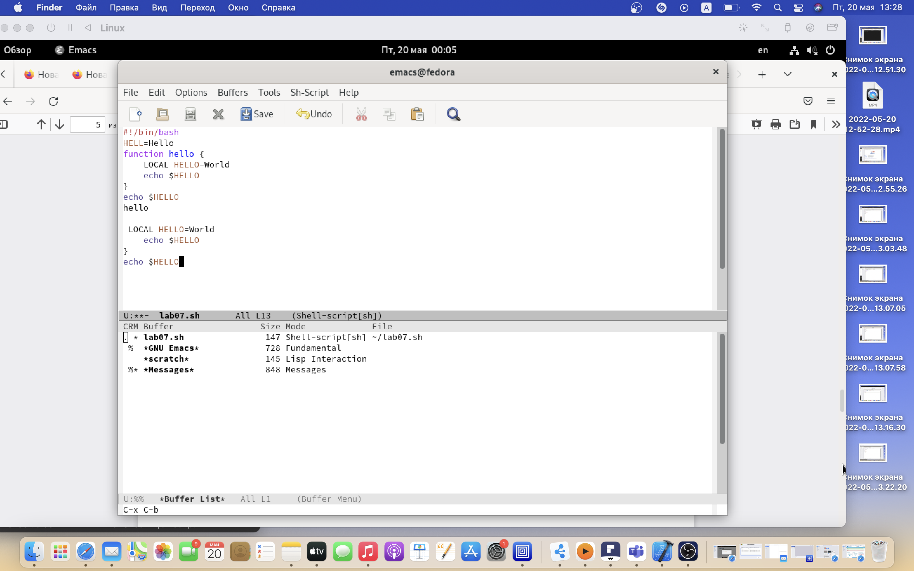{ #fig:012 width=70% }
 
7.2. Перемещаюсь во вновь открытое окно (C-x) o со списком открытых буферов и переключаюсь на другой буфер.(рис. -@fig:013)
 
{ #fig:013 width=70% }
 
7.3. Закрываю это окно (C-x 0).(рис. -@fig:014)
 
{ #fig:014 width=70% }
 
 Вновь переключаюсь между буферами, но без вывода их списка на экран (C-x b).
 
8. Управление окнами.
 
8.1. Поделю фрейм на 4 части: разделю фрейм на два окна по вертикали
 
(C-x 3), а затем каждое из этих окон на две части по горизонтали (C-x 2).(рис. -@fig:015)
 
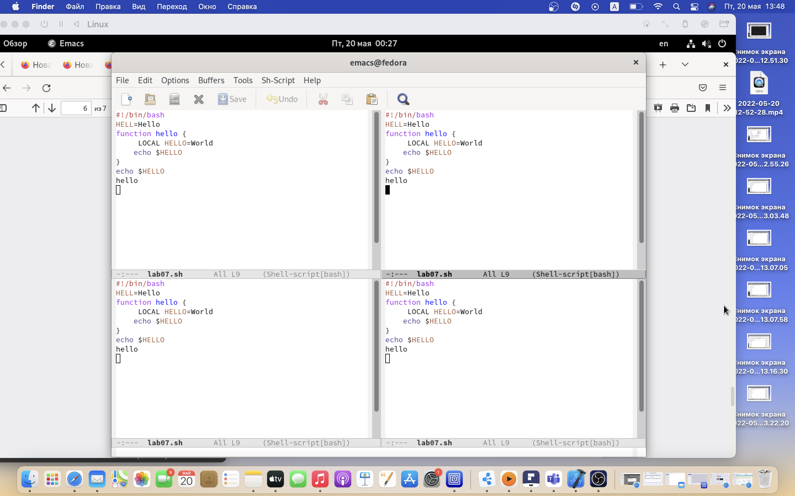{ #fig:015 width=70% }
 
8.2. В каждом из четырёх созданных окон открываю новый буфер (файл) и ввожу несколько строк текста.(рис. -@fig:016)
 
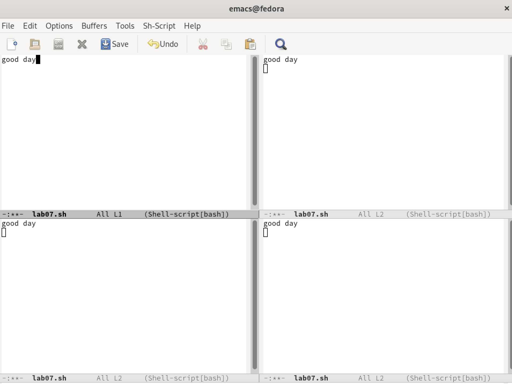{ #fig:016 width=70% }
 
9. Режим поиска
 
9.1. Переключаюсь в режим поиска (C-s) и нахожу несколько слов, присутствующих в тексте.(рис. -@fig:017)
 
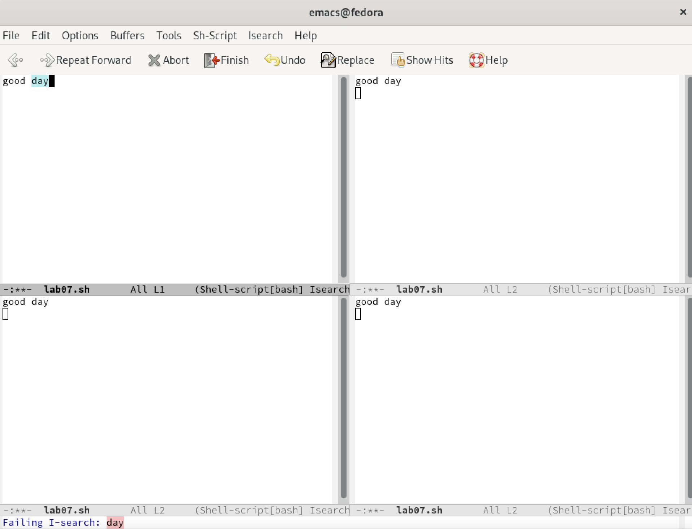{ #fig:017 width=70% }
 
9.2. Переключаюсь между результатами поиска, нажимая C-s.(рис.-@fig:018)
 
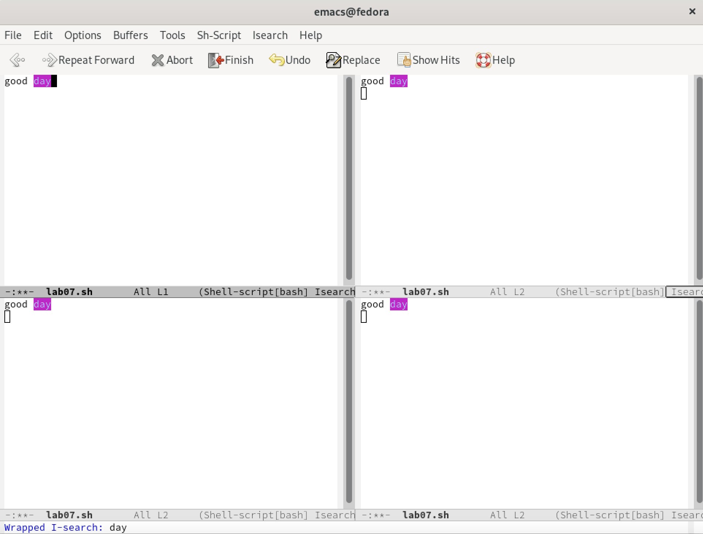{ #fig:018 width=70% }
 
9.3. Выхожу из режима поиска, нажав C-g.(рис. -@fig:019)
 
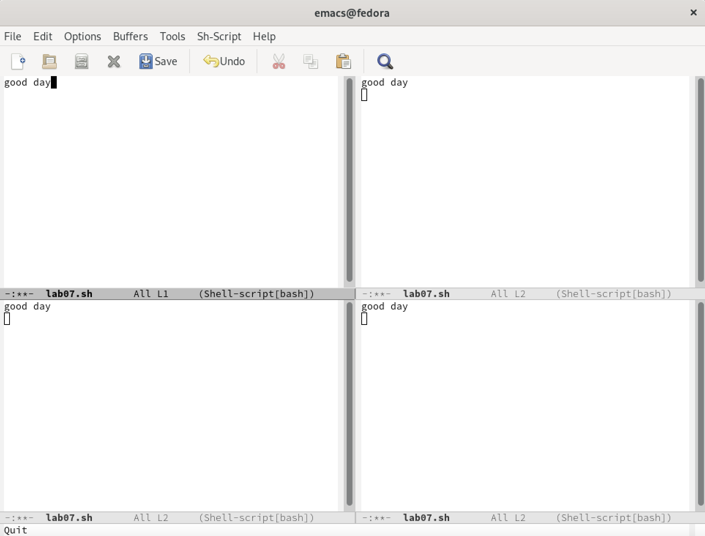{ #fig:019 width=70% }
 
9.4. Перехожу в режим поиска и замены (M-%), ввожу текст, который следует найти и заменить, нажимаю Enter , затем ввожу текст для замены. После того как были подсвечены результаты поиска, нажимаю ! для подтверждения замены.
 
Перехожу в режим поиска и замены. (рис. -@fig:020)
 
{ #fig:020 width=70% }
 
9.5. Испробую другой режим поиска, нажав M-s o. Он отличается от обычного режима тем, что при поиске указывает номера строк в которых найдено введённое слово и выделяет их цветом. В обычном режиме выделение цветом появляется, только когда нужно подтвердить замену.(рис. -@fig:021)
 
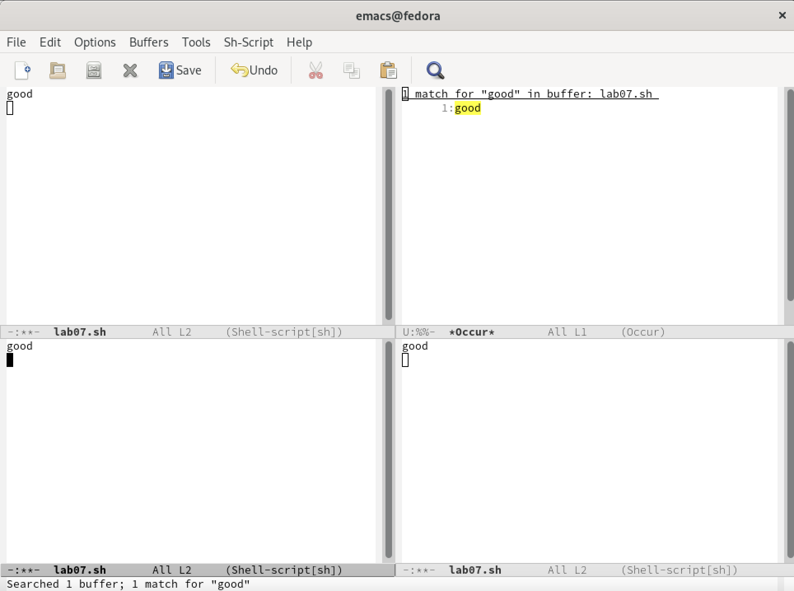{ #fig:021 width=70% }
 
# Вывод
 
В данной лабораторной работе № 9 я познакомилась с операционной системой Linux, получила практические навыки работы с редактором Emacs.
 
# Контрольные вопросы
1. Кратко охарактеризуйте редактор emacs.
 
2. Какие особенности данного редактора могутсделать его сложным для освоения но-
вичком?
 
3. Своими словами опишите,чтотакое буфер и окно втерминологии emacs’а.
 
4. Можно ли открыть больше 10 буферов в одном окне?
 
5. Какие буферы создаются по умолчанию при запуске emacs?
 
6. Какие клавиши вы нажмёте,чтобы ввести следующую комбинацию C-c | и C-c C-|?
 
7. Как поделитьтекущее окно на две части?
 
8. В каком файле хранятся настройки редактора emacs?
 
9. Какую функцию выполняет клавиша и можно ли её переназначить?
 
10. Какой редактор вам показался удобнее в работе vi или emacs? Поясните почему.
 
# Ответы на контрольные вопросы:
 
1. Emacs представляет собой мощный экранный редактор текста, написанный на
языке высокого уровня Elisp.
 
2. Развитие Emacs в сторону его многогранности послужило причиной того, что и без того интуитивно непонятная программа стала чрезвычайно сложной в применении. В частности, управление осуществляется при помощи различных клавиатурных комбинаций, запомнить которые будет непросто.
 
3. Буфер – что-то, состоящее из текста. 
Окно – область с одним из буферов.
 
4. В одном окне можно открыть больше 10 буферов.
 
5. После запуска emacs без каких-либо параметров в основном окне отображается буфер *scratch*, который используется для оценки выражений Emacs Lisp, а также для заметок, которые вы не хотите сохранять. Этот буфер не сохраняется автоматически.
 
6. Чтобы ввести следующую комбинацию C-c | я нажму клавиши: Control+c и Shift+\, и для C-c C-|: Control+c и Control+Shift+\.
 
7. Поделить текущее окно на две части можно двумя комбинациями клавиш: 
C-x 3 или C-x 2.
 
8. Настроить или расширить Emacs можно написав или изменив файл ~/.emacs.
 
9. Клавиша  выполняет функцию перемещения курсора в открытом окне также, как и многие другие клавиши её можно переназначить.
 
10. Редактор emacs показался мне удобнее из-за возможности открытия нескольких окон с буферами и работать комбинациями клавиш в этот редакторе мне было проще.
--
