---
## Front matter
lang: ru-RU
title: программирования в оболочке ОС UNIX/Linux
author: |
      Кристина Алексеевна Антипина НБИбд-01-21\inst{1}
 
institute: |
    \inst{1}Российский Университет Дружбы Народов
 
date: 21 мая, 2022, Москва, Россия
 
## Formatting
mainfont: PT Serif
romanfont: PT Serif
sansfont: PT Sans
monofont: PT Mono
toc: false
slide_level: 2
theme: metropolis
header-includes: 
 - \metroset{progressbar=frametitle,sectionpage=progressbar,numbering=fraction}
 - '\makeatletter'
 - '\beamer@ignorenonframefalse'
 - '\makeatother'
aspectratio: 43
section-titles: true
 
---
--

# Цель работы: 
 
Изучить основы программирования в оболочке ОС UNIX/Linux, научиться писать небольшие командные файлы.
 
# Ход работы:
 
1.Пишу скрипт, который при запуске будет делать резервную копию самого себя (то есть файла, в котором содержится его исходный код) в другую директорию backup в домашнем каталоге. При этом файл должен архивироваться одним из архиваторов на выбор zip, bzip2 или tar. Способ использования команд архивации узнал, изучив справку.(рис. -@fig:001)(рис. -@fig:002)(рис. -@fig:003)(рис. -@fig:004)(рис. -@fig:005)(рис. -@fig:006)
 
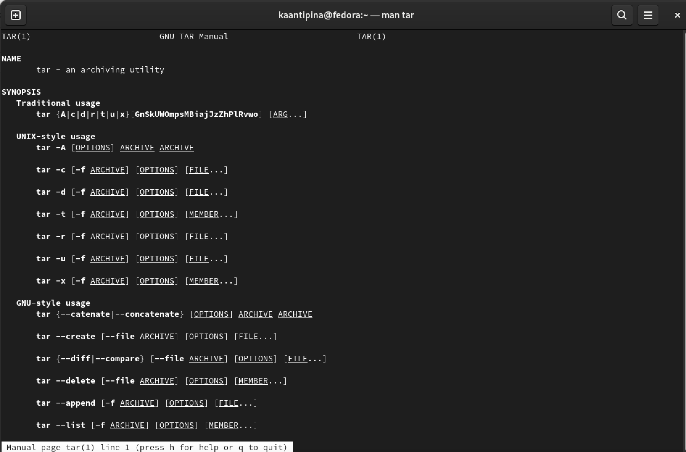{ #fig:001 width=70% }
 
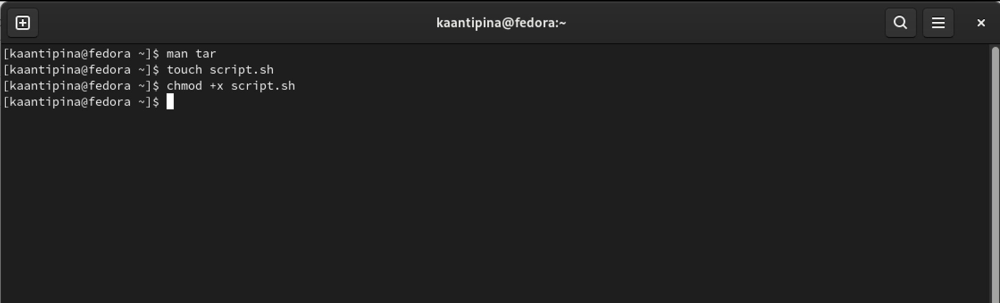{ #fig:002 width=70% }
 
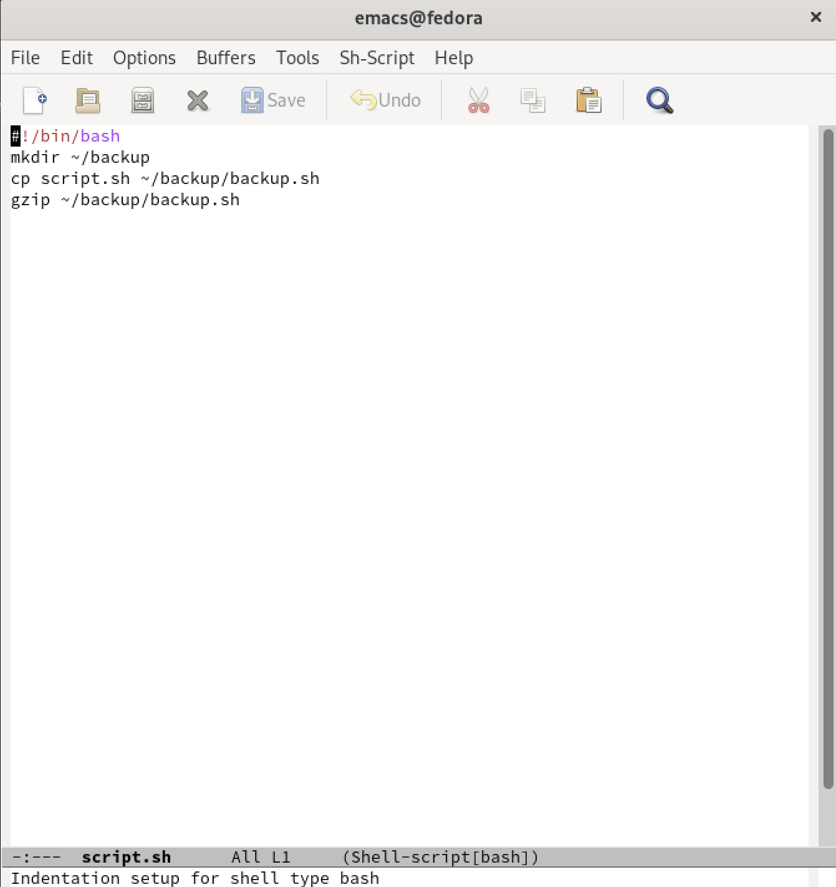{ #fig:003 width=70% }
 
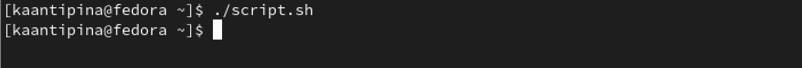{ #fig:004 width=70% }
 
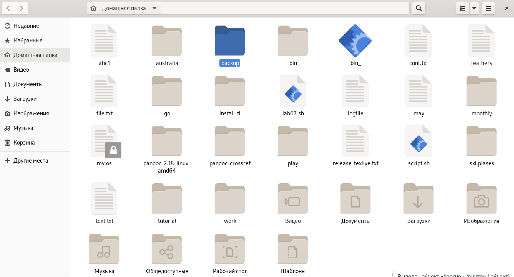{ #fig:005 width=70% }
 
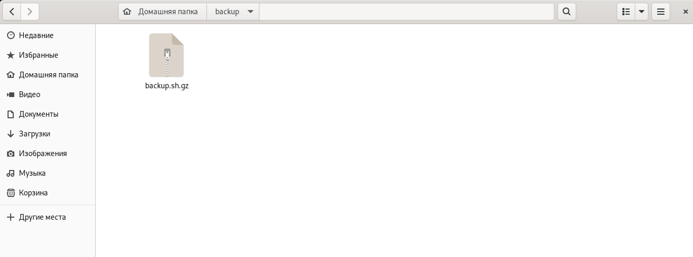{ #fig:006 width=70% }
 
2.Пишу пример командного файла, обрабатывающего любое произвольное
число аргументов командной строки, в том числе превышающее десять. Например, скрипт может последовательно распечатывать значения всех переданных аргументов.(рис. -@fig:007)(рис. -@fig:008)
 
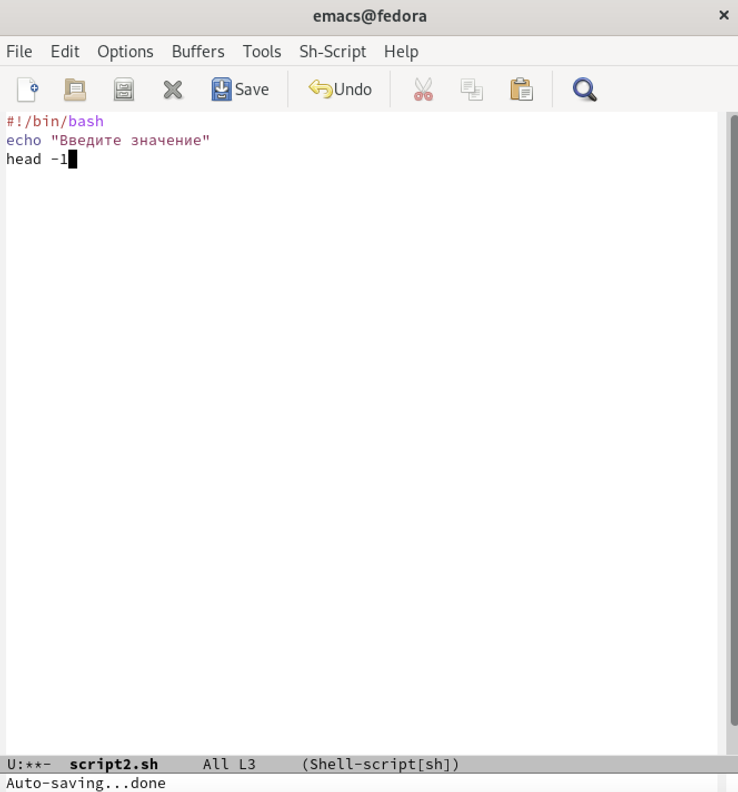{ #fig:007 width=70% }
 
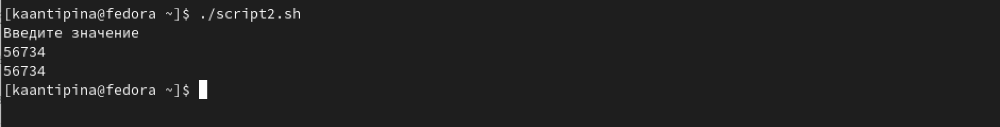{ #fig:008 width=70% }
 
3.Пишу командный файл — аналог команды ls (без использования самой этой
команды и команды dir). Требуется, чтобы он выдавал информацию о нужном
каталоге и выводил информацию о возможностях доступа к файлам этого каталога.(рис. -@fig:009)(рис. -@fig:010)
 
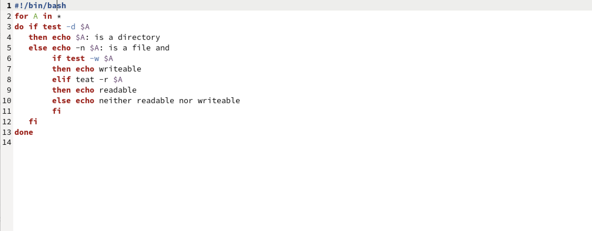{ #fig:009 width=70% }
 
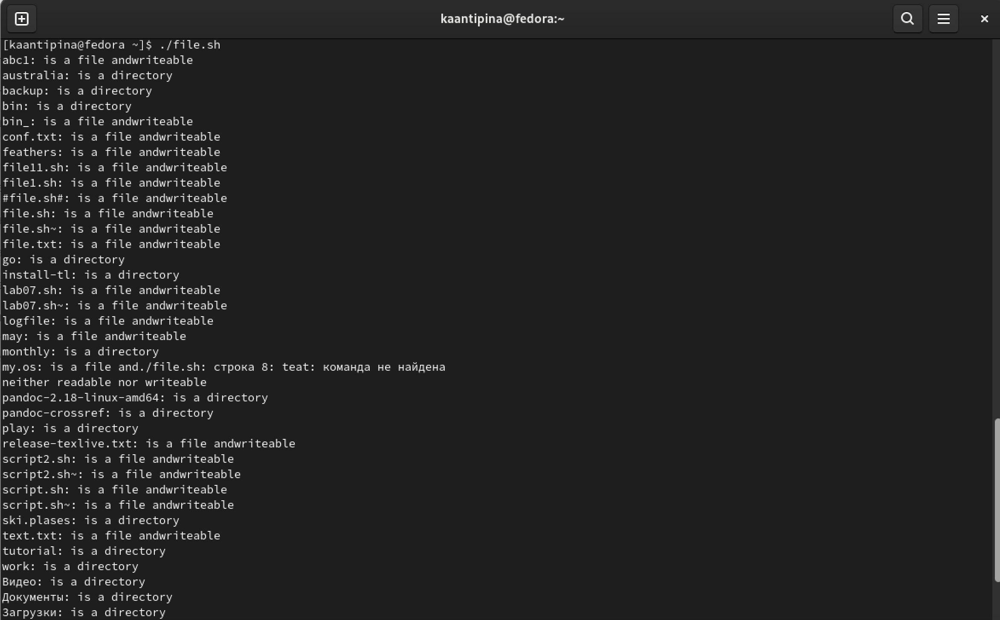{ #fig:010 width=70% }
 
4.Пишу командный файл, который получает в качестве аргумента командной
строки формат файла (.txt, .doc, .jpg, .pdf и т.д.) и вычисляет количество
таких файлов в указанной директории. Путь к директории также передаётся в
виде аргумента командной строки.(рис. -@fig:011)(рис. -@fig:012)
 
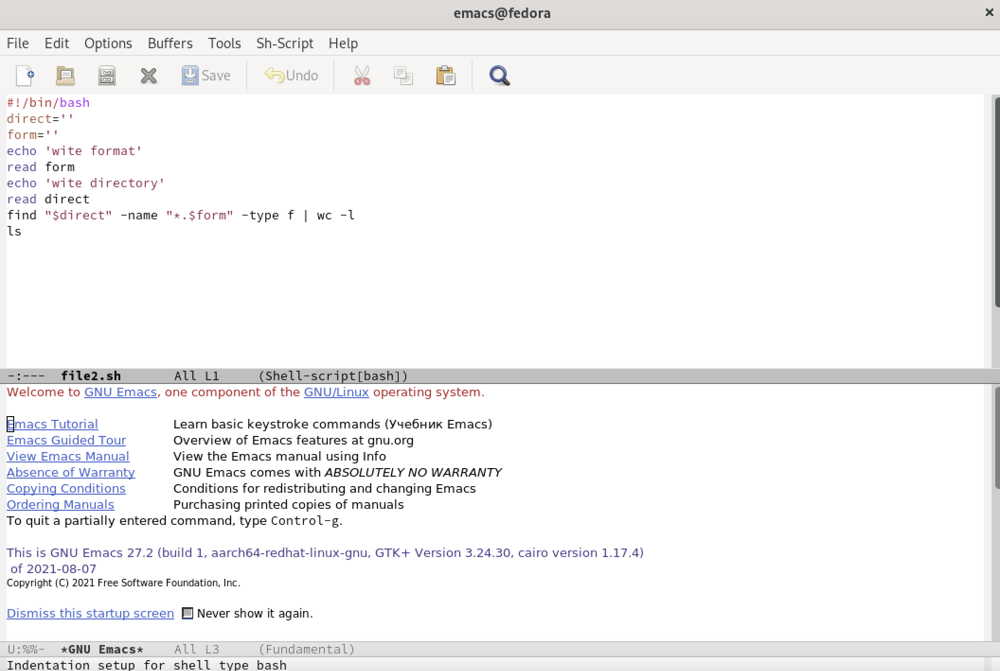{ #fig:011 width=70% }
 
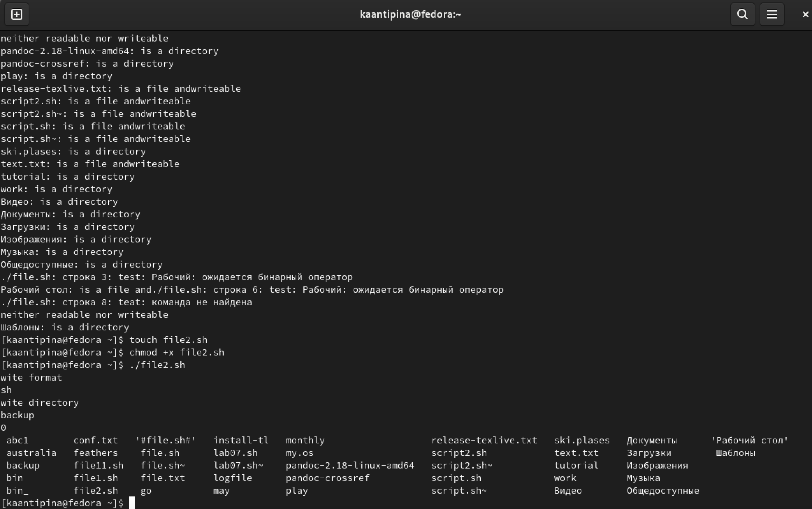{ #fig:012 width=70% }
 
# Вывод:
 
В данной лабораторной работе я изучила основы программирования в оболочке ОС UNIX/Linux, научилась писать небольшие командные файлы.
 

--
