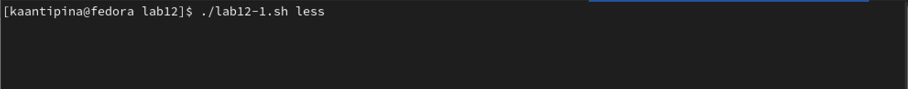

---
## Front matter
lang: ru-RU
title: "Программирование в командном процессоре ОС UNIX. Расширенное программирование"
author: |
      Кристина Алексеевна Антипина НБИбд-01-21\inst{1}
 
institute: |
    \inst{1}Российский Университет Дружбы Народов
 
date: 27 мая, 2022, Москва, Россия
 
## Formatting
mainfont: PT Serif
romanfont: PT Serif
sansfont: PT Sans
monofont: PT Mono
toc: false
slide_level: 2
theme: metropolis
header-includes: 
 - \metroset{progressbar=frametitle,sectionpage=progressbar,numbering=fraction}
 - '\makeatletter'
 - '\beamer@ignorenonframefalse'
 - '\makeatother'
aspectratio: 43
section-titles: true
 
---
--

# Цель работы
 
Изучить основы программирования в оболочке ОС UNIX. Научиться писать более сложные командные файлы с использованием логических управляющих
конструкций и циклов
 
# Ход работы:
 
1. Напишу командный файл, реализующий упрощённый механизм семафоров. Командный файл должен в течение некоторого времени t1 дожидаться освобождения ресурса, выдавая об этом сообщение, а дождавшись его освобождения, использовать его в течение некоторого времени t2<>t1, также выдавая информацию о том, что ресурс используется соответствующим командным файлом (процессом). Запускаю командный файл в одном виртуальном терминале в фоновом режиме, перенаправив его вывод в другой (> /dev/tty#, где # — номер терминала куда перенаправляется вывод), в котором также запущен этот файл, но не фоновом, а в привилегированном режиме. Доработать программу так, чтобы имелась возможность взаимодействия трёх и более процессов.(рис. -@fig:001)(рис. -@fig:002)(рис. -@fig:003)
 
{ #fig:001 width=70% }
 
{ #fig:002 width=70% }
 
{ #fig:003 width=70% }
 
2. Реализую команду man с помощью командного файла. Изучу содержимоемкаталога /usr/share/man/man1. В нем находятся архивы текстовых файлов,
содержащих справку по большинству установленных в системе программ и команд. Каждый архив можно открыть командой less сразу же просмотрев содержимое справки. Командный файл должен получать в виде аргумента командной строки название команды и в виде результата выдавать справку об этой команде или сообщение об отсутствии справки, если соответствующего файла нет в каталоге man1.(рис. -@fig:004)(рис. -@fig:005)(рис. -@fig:006)(рис. -@fig:007)(рис. -@fig:008)
 
{ #fig:004 width=70% }
 
{ #fig:005 width=70% }
 
{ #fig:006 width=70% }
 
{ #fig:007 width=70% }
 
{ #fig:008 width=70% }
 
3. Используя встроенную переменную $RANDOM, напишу командный файл, генерирующий случайную последовательность букв латинского алфавита. Учту,
что $RANDOM выдаёт случайные числа в диапазоне от 0 до 32767.(рис. -@fig:009)(рис. -@fig:010)(рис. -@fig:011)
 
{ #fig:009 width=70% }
 
{ #fig:010 width=70% }
 
{ #fig:011 width=70% }
 
# Вывод:
 
В данной лабораторной работе № 12 я изучила основы программирования в оболочке ОС UNIX, научилась писать более сложные командные файлы с использованием логических управляющих конструкций и циклов.
 

