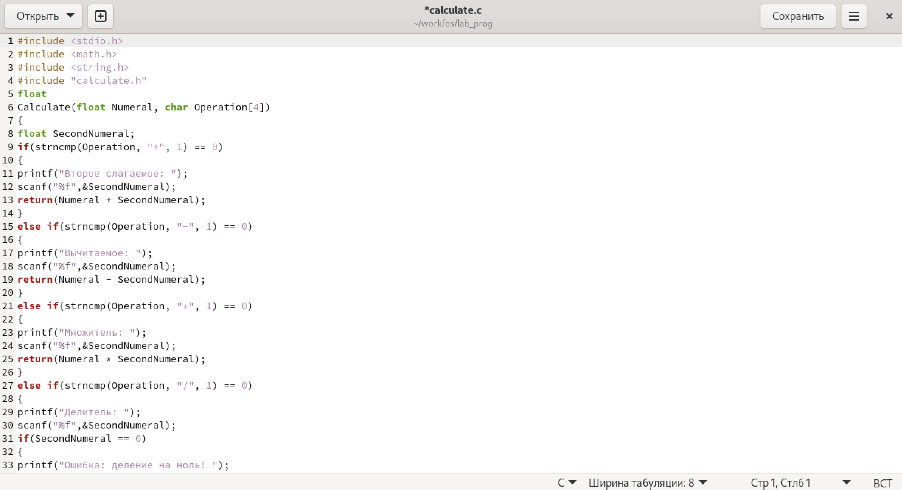
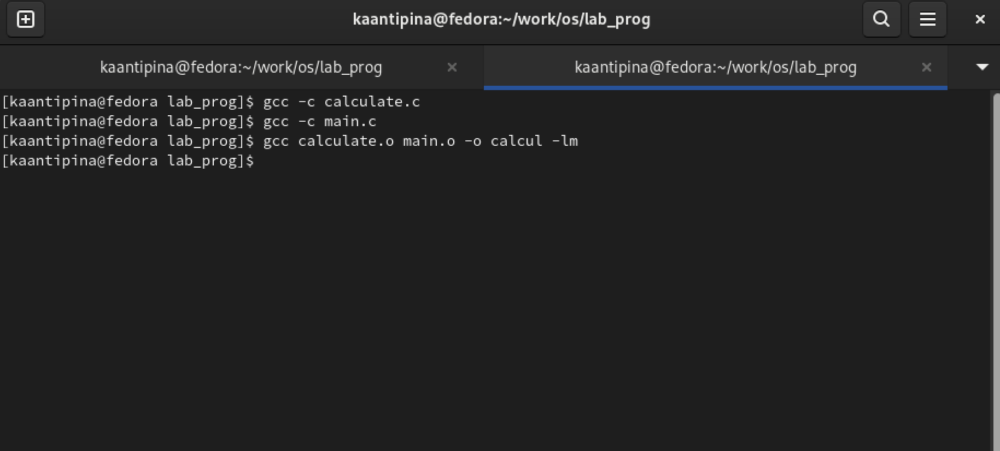

---
## Front matter
lang: ru-RU
title: "Средства, применяемые при
разработке программного обеспечения в ОС типа UNIX/Linux"
author: |
      Кристина Алексеевна Антипина НБИбд-01-21\inst{1}
 
institute: |
    \inst{1}Российский Университет Дружбы Народов
 
date: 3 июня, 2022, Москва, Россия
 
## Formatting
mainfont: PT Serif
romanfont: PT Serif
sansfont: PT Sans
monofont: PT Mono
toc: false
slide_level: 2
theme: metropolis
header-includes: 
 - \metroset{progressbar=frametitle,sectionpage=progressbar,numbering=fraction}
 - '\makeatletter'
 - '\beamer@ignorenonframefalse'
 - '\makeatother'
aspectratio: 43
section-titles: true
 
---

# Цель работы
 
Приобрести простейшие навыки разработки, анализа, тестирования и отладки приложений в ОС типа UNIX/Linux на примере создания на языке программирования С калькулятора с простейшими функциями.
 

# Выполнение лабораторной работы
 
1. В домашнем каталоге создаю подкаталог ~/work/os/lab_prog с помощью команды «mkdir lab_prog».
2. Создаю в каталоге файлы: calculate.h, calculate.c, main.c, используя команды «cd lab_prog» и «touch calculate.h calculate.c main.c» (рис. -@fig:001).
 
{ #fig:001 }
 
Это будет примитивнейший калькулятор, способный складывать, вычитать, умножать и делить, возводить число в степень, брать квадратный корень, вычислять sin, cos, tan. При запуске он будет запрашивать первое число, операцию, второе число. После этого программа выведет результат и остановится.  
Открыв редактор Emacs, приступаю к редактированию созданных файлов.  
Реализация функций калькулятора в файле calculate.с (рис. -@fig:002) (рис. -@fig:003).
 
{ #fig:002 }
 
{ #fig:003 }
 
Интерфейсный файл calculate.h, описывающий формат вызова функции калькулятора (рис. -@fig:004).
 
{ #fig:004 }
 
Основной файл main.c, реализующий интерфейс пользователя к калькулятору (рис. -@fig:005).
 
{ #fig:005 }
 
3. Выполню компиляцию программы посредством gcc, используя команды «gcc -c calculate.c», «gcc -c main.c» и «gcc calculate.o main.o -o calcul -lm» (рис. -@fig:006).
 
{ #fig:006 }
 
4. В ходе компиляции программы никаких ошибок выявлено не было.
5. Создаю Makefile с необходимым содержанием (рис. -@fig:007). Данный файл необходим для автоматической компиляции файлов calculate.c (цель calculate.o), main.c (цель main.o), а также их объединения в один исполняемый файл calcul (цель calcul). Цель clean нужна для автоматического удаления файлов. Переменная CC отвечает за утилиту для компиляции. Переменная CFLAGS отвечает за опции в данной утилите. Переменная LIBS отвечает за опции для объединения объектных файлов в один исполняемый файл.
 
{ #fig:007 }
 
6. Далее исправляю Makefile (рис. -@fig:008). В переменную CFLAGS добавляю опцию -g, необходимую для компиляции объектных файлов и их использования в программе отладчика GDB. Сделаю так, что утилита компиляции выбирается с помощью переменной CC.
 
{ #fig:008 }
 
После этого я удалю исполняемые и объектные файлы из каталога с помощью команды «make clean». Выполню компиляцию файлов, используя команды «make calculate.o», «make main.o», «male calcul» (рис. -@fig:009).
 
{ #fig:009 }
 
Далее с помощью gdb выполню отладку программы calcul. Запускаю отладчик GDB, загрузив в него программу для отладки, используя команду: «gdb ./calcul» (рис. -@fig:010).
 
{ #fig:010 }
 
Для запуска программы внутри отладчика ввожу команду «run» (рис. -@fig:011).
 
{ #fig:011 }
 
Для постраничного (по 10 строк) просмотра исходного кода использую команду «list» (рис. -@fig:012).
 
{ #fig:012 }
 
Для просмотра строк с 12 по 15 основного файла использую команду «list 12,15» (рис. -@fig:013).
 
{ #fig:013 }
 
Для просмотра определённых строк не основного файла использую команду «list calculate.c:20,29» (рис. -@fig:014).
 
{ #fig:014 }
 
Устанавливаю точку останова в файле calculate.c на строке номер 21, используя команды «list calculate.c:20,27» и «break 21» (рис. -@fig:015).
 
{ #fig:015 }
 
Вывожу информацию об имеющихся в проекте точках останова с помощью команды «info breakpoints» (рис. -@fig:016).
 
{ #fig:016 }
 
Запускаю программу внутри отладчика, программа остановилась в момент прохождения точки останова. Использую команды «run», «5», «−» и «backtrace» (рис. -@fig:017).
 
{ #fig:017 }
 
Посмотрю, чему равно на этом этапе значение переменной Numeral, введя команду «print Numeral». Сравню с результатом вывода на экран после использования команды «display Numeral». Значения совпадают. Убираю точку останова с помощью команд «info breakpoints» и «delete 3» (рис. -@fig:018).
 
{ #fig:018 }
 
7. С помощью утилиты splint проанализирую коды файлов calculate.c и main.c. Воспользуюсь командами «splint calculate.c» и «splint
main.c» (рис. -@fig:019) (рис. -@fig:020).  
C помощью утилиты splint выяснилось, что в файлах calculate.c и main.c присутствует функция чтения scanf, возвращающая целое число (тип int), но эти числа не используются и нигде не сохранятся. Утилита вывела предупреждение о том, что в файле calculate.c происходит сравнение вещественного числа с нулем. Также возвращаемые значения (тип double) в функциях pow, sqrt, sin, cos и tan записываются в переменную типа float, что свидетельствует о потери данных.
 
{ #fig:019 }
 
{ #fig:020 }
 

# Вывод
 
В ходе выполнения лабораторной работы № 13 я приобрела простейшие навыки разработки, анализа, тестирования и отладки приложений в ОС типа UNIX/Linux на примере создания на языке программирования С калькулятора с простейшими функциями.
