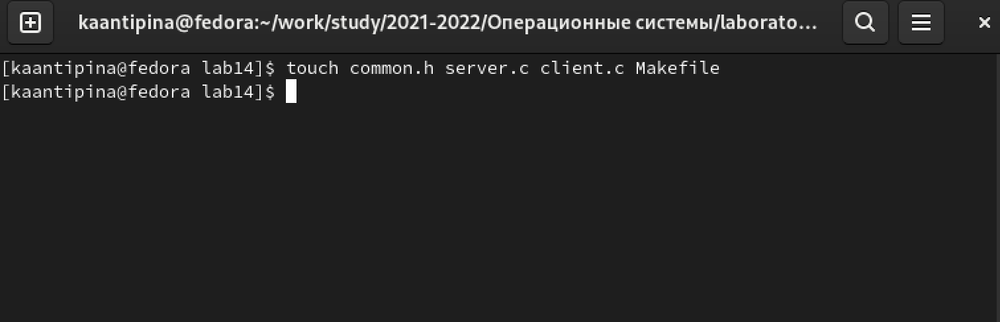
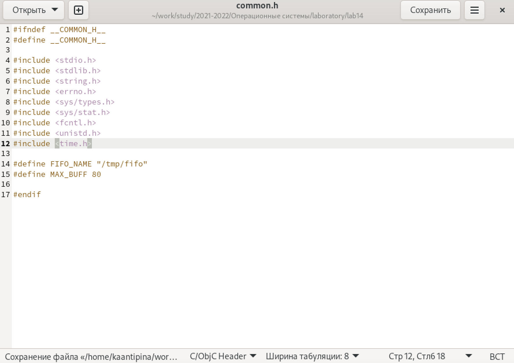
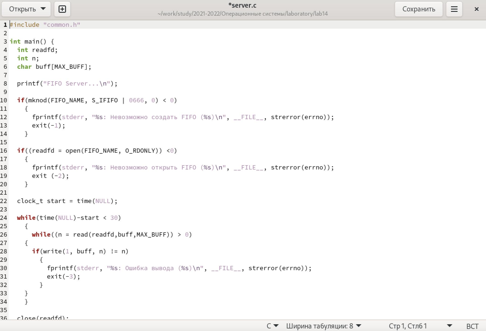
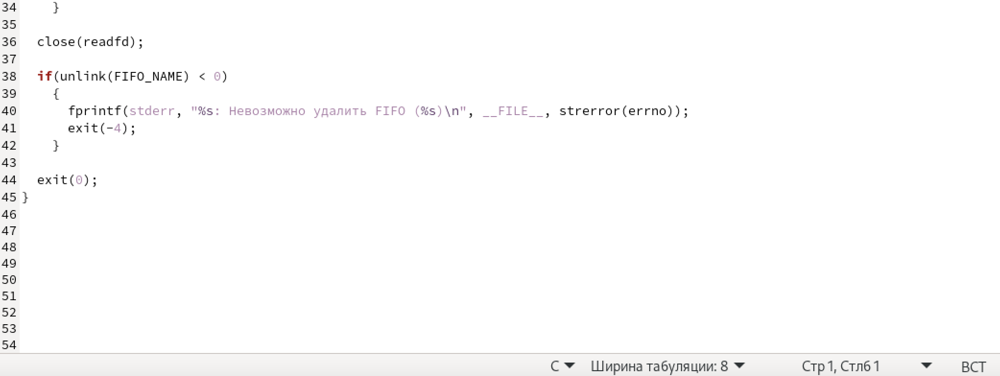
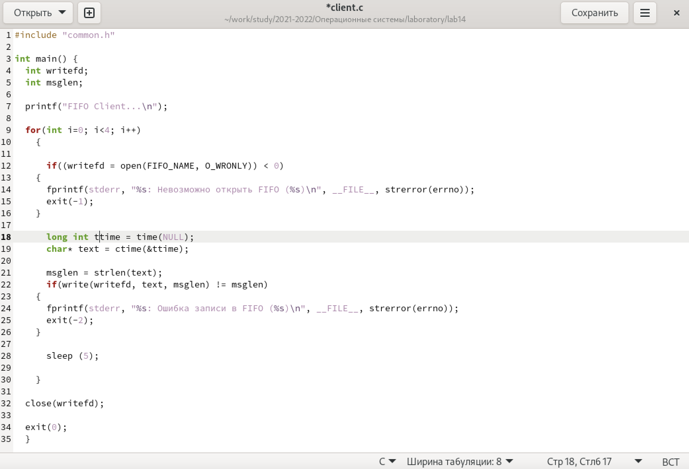
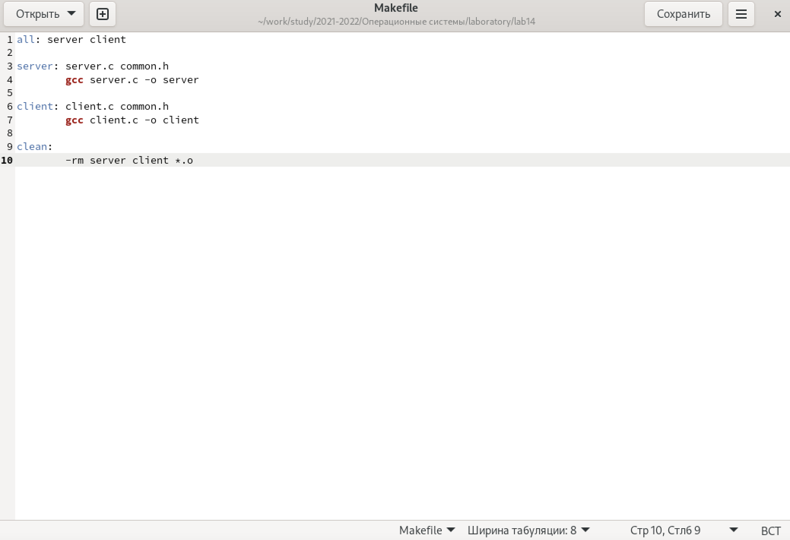
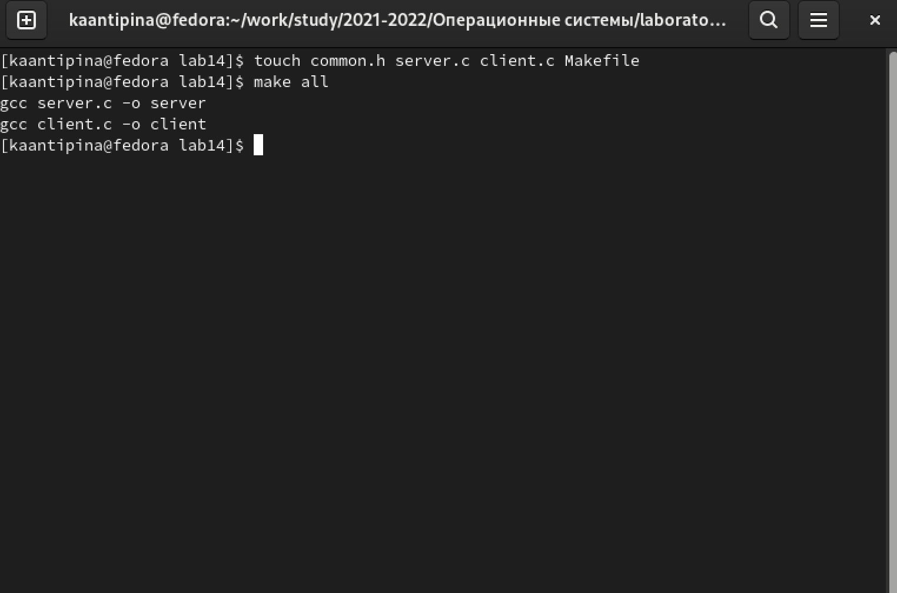
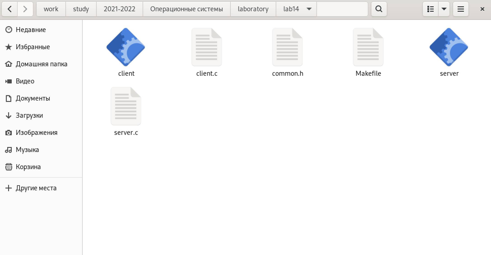
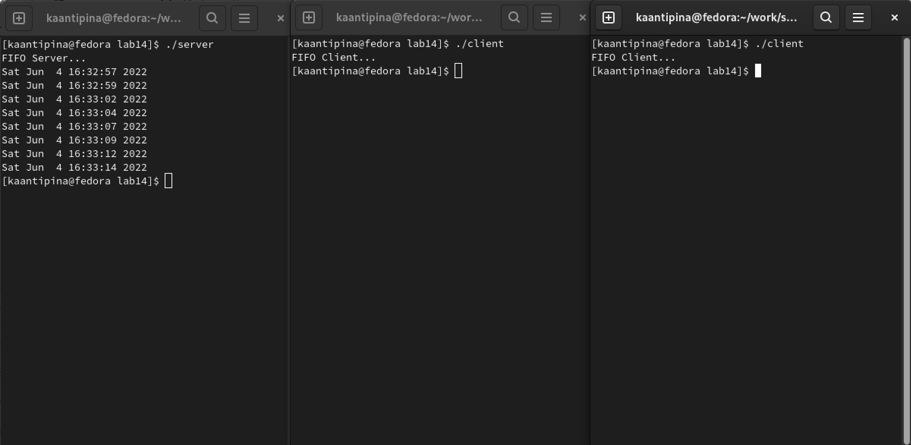
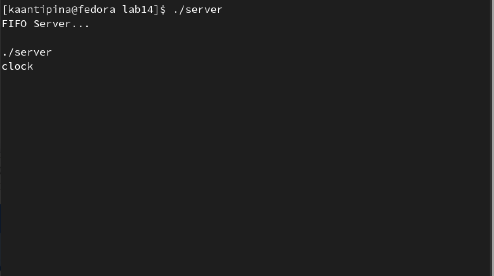

---
## Front matter
lang: ru-RU
title: "Именованные каналы"
author: |
      Кристина Алексеевна Антипина НБИбд-01-21\inst{1}
 
institute: |
    \inst{1}Российский Университет Дружбы Народов
 
date: 4 июня, 2022, Москва, Россия
 
## Formatting
mainfont: PT Serif
romanfont: PT Serif
sansfont: PT Sans
monofont: PT Mono
toc: false
slide_level: 2
theme: metropolis
header-includes: 
 - \metroset{progressbar=frametitle,sectionpage=progressbar,numbering=fraction}
 - '\makeatletter'
 - '\beamer@ignorenonframefalse'
 - '\makeatother'
aspectratio: 43
section-titles: true
 
---
 
# Цель работы
 
Приобретение практических навыков работы с именованными каналами.
 
# Ход работы
 
1. Создаю необходимые файлы с помощью команды «touch common.h server.c client.c Makefile»  и открываю редактор emacs для их редактирования.(рис. -@fig:001)
 
{ #fig:001 width=70% }
 
2. Далее я изменю коды программ, представленных в тексте лабораторной работы.
В файл common.h добавлю стандартные заголовочные файлы unistd.h и time.h, необходимые для работы кодов других файлов. Common.h предназначен для заголовочных файлов, чтобы в остальных программах их не прописывать каждый раз(рис. -@fig:002)
 
{ #fig:002 width=70% }
 
В файл server.c добавлю цикл while для контроля за временем работы сервера. Разница между текущим временем time(NULL) и временем начала работы clock_t start=time(NULL) (инициализация до цикла) не должна превышать 30 секунд (рис. -@fig:003) (рис. -@fig:004)
 
{ #fig:003 width=70% }
 
{ #fig:004 width=70% }

В файл client.c добавлю цикл, который отвечает за количество сообщений о текущем времени (4 сообщения), которое получается в результате выполнения команд, и команду sleep(5) для приостановки работы клиента на 5 секунд.(рис. -@fig:005)
 
{ #fig:005 width=70% }
 
Makefile (файл для сборки) не меняю (рис. -@fig:006)
 
{ #fig:006 width=70% }
 
3. После написания кодов, я, используя команду «make all», скомпилирую необходимые файлы (рис. -@fig:007)(рис. -@fig:008)
 
{ #fig:007 width=70% }
 
{ #fig:008 width=70% }
 
Далее я проверю работу написанного кода.
Открою 3 консоли (терминала) и запускаю: в первом терминале − «./server», в остальных двух – «./client». В результате каждый терминал-клиент вывел по 4 сообщения. Спустя 30 секунд работа сервера была прекращена. Программа работает корректно.(рис. -@fig:009)
 
{ #fig:009 width=70% }
 
Также я  проверю длительность работы сервера, введя команду «./server» в одном терминале. Он завершил свою работу через 30 секунд.
Если сервер завершит свою работу, не закрыв канал, то, когда мы будем запускать этот сервер снова.(рис. -@fig:010)
 
{ #fig:010 width=70% }

# Вывод
 
В ходе выполнения лабораторной работы № 14 я приобрела практические навыки работы с именованными каналами.
 

